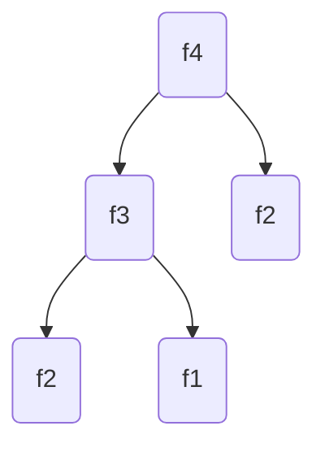

>## 동적 계획법

### 조건
1. 최적 부분 구조(Optimal Substructure)
    * 부분 문제의 결과를 조합하여 상위 문제를 해결할 수 있는 구조
2. 중복되는 부분 문제 (Overlapping)
    * 그 부분 문제들이 중복되는 상황

### 피보나치 수열
```
1, 1, 2, 3, 5, 8, 13, 21, 33, ...
```
$$f_1 = 1$$

$$f_2 = 1$$

$$f_n = f_{n-1} + f_{n-2}$$




#### 재귀함수로 표현
```java
int f(int n){
    //종료조건
    if(n == 1 || n == 2) return 1;
    //점화식 표현
    return f(n-1) + f(n-2);
}
```
* f4를 구하기 위해서 f3, f2의 값이 필요
    * f3을 구하기 위해서 f2, f1의 값이 필요
* 중복되는 f2(하위 문제)의 값이 필요
* 시간 복잡도 : O(2<sup>n</sup>)
    * 지수 시간 복잡도는 n이 커질 수록 시간복잡도가 굉장히 올라감
    * 중복되는 부분 문제에 대한 해결 필요
### 하향식 
* 큰 문제를 해결하기 위해 작은 문제를 호출하는 기법
* 메모이제이션(Memoization)
    * 계산한 부분문제의 값을 기록해 두는 기법
    * 캐싱

```java
int[] memo;

int f(int n){
    //메모이제이션 
    //n 번쨰 인덱스의 값을 저장할 배열
    if(memo == null) memo = new int[n+1];
    //이미 계산된 값이라면 배열에 저장된 값 사용
    if (memo[n] != 0) return memo[n]; 
    //종료조건
    if(n == 1 || n == 2) return 1;
    //점화식 표현
    return f(n-1) + f(n-2);
}
```

### 상향식
* 작은 문제들을 이용하여 큰 문제의 값을 구하는 기법
* DP 테이블
    * 부분 결과의 값을 저장하는 배열(or 리스트)

```java
//DP 테이블
List<Integer> list = new ArrayList<>();

int f(int n){
    //0~2번째 부분 문제 결과 저장
    list.add(0);
    list.add(1);
    list.add(1);
    //점화식
    for(int i=3; i <= n; i++){
        list.add(list.get(i-1)+list.get(i-2));
    }
    return list.get(n);
}
```


