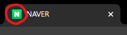

# HTML5
> ## Hyper Text Markup Language
* Hyper Text : 시공간을 초월하는 텍스트
* Markup : 태그 형식
* HTML은 웹 페이지를 만들기 위한 표준 마크업 언어
* 요소(element)
    * 시작태그 + 내용 + 종료(닫기)태그
    * 내용이 없는 요소는 닫기태그가 없을 수 있음
```html
<span>내용</span>
```
### 코딩 가이드
1. 문서 유형 선언 : 대문자 권장
2. 요소 : 소문자 권장
3. 속성=속성값 : 등호 양옆에 공백 사용X
4. 파일경로는 대소문자 구분 함
5. \<p>태그는 닫기 태그가 없어도 역할을 하지만 꼭 닫기
6. 확장자 : .html .htm(리눅스)
> ## 기본 구조
```html
<!DOCTYPE html>
<html>
    <head>
        <meta charset="UTF-8">
        <title></title>
    </head>
    <body>
    </body>
</html>
```
* \<!DOCTYPE html>
  * ! : 선언문
  * 문서타입이 HTML이라 선언
* \<html>\</html>
  * 필수 요소
  * root(루트) 요소
  * 모든 요소의 부모 요소
* \<head>\</head>
  * html문서에 대한 메타 정보
  * \<title>\</title>
    * html 문서의 제목을 지정하는 요소
    * 브라우저에 표시
  * \<style>\</style>
    * html문서의 스타일 정보 정의
  * \<meta>
    * 메타 정보를 지정하는 요소
    *  charset="UTF-8" : 인코딩 정의
    *  name="keywords" 
    *  content="html css javascript" 키워드 정의
  * \<script></script>
    * js 코딩
  * \<base>
    * 해당 문서의 상대 주소들의 기본 주소를 지정
* \<body>\</body>
  * 필수 요소
  * 브라우저 화면에 표시하는 내용을 담고 있는 요소
---
# 태그 소개
> ## 헤더(Headers)
* 제목을 나타내기 위한 태그
* Block 모드
* 검색엔진이 헤더 태그를 통하여 웹 페이지의 구조를 파악


<H1>이것은 제목입니다</H1>
<H2>이것은 제목입니다</H2>
<H3>이것은 제목입니다</H3>
<H4>이것은 제목입니다</H4>
<H5>이것은 제목입니다</H5>
<H6>이것은 제목입니다</H6>

```html
<H1>이것은 제목입니다</H1>
<H2>이것은 제목입니다</H2>
<H3>이것은 제목입니다</H3>
<H4>이것은 제목입니다</H4>
<H5>이것은 제목입니다</H5>
<H6>이것은 제목입니다</H6>
```

> ## \<br> Line Break
* 줄 바꿈 태그

두부<br>
쿠키<br>
```html
두부<br>
쿠키<br>
```

<>

> ## \<hr>
* 수평선 태그
<hr color="red">
<hr color="green" width="50%">
<hr color="blue" width = "30px" align="left">

```html
<hr color="red">
<hr color="green" width="50%">
<hr color="blue" width = "30px" align="left">
```

> ## \<p>\</p>  Paragraph
* 문단(단락) 태그
* Block 모드

<p>문단 1</p>
<p>문단 2</p>
<p>문단 3</p>

```html
<p>문단 1</p>
<p>문단 2</p>
<p>문단 3</p>
```

> ## \<sapn>\</span>
* 스타일을 정의하는 데 사용할 수 있는 컨테이너 

```html
<!DOCTYPE html>
<html>
  <head>
    <style>
      span {
        /* CSS */
        color : red;
        border : 1px solid blue;
      }
    </style>
  </head>
  <body>
    나는 <span>두부쿠키</span>입니다.
  </body>
</html>
```

> ## \<pre>\</pre> preformatted text
* 태그 안 내용의 공백, 개행 유지
* 고정 너비 글꼴로 표시
* 미리 형식이 지정된 텍스트 정의
<pre>
package test;

public class Test {

	public static void main(String[] args) {

	
	}//main

}//class
</pre>
```html
<pre>
package test;

public class Test {

	public static void main(String[] args) {

	
	}//main

}//class
</pre>
```
> ## 텍스트 관련 태그
1. \<b> 굵은 글꼴, 중요성X
 
나는 <b>두부쿠키</b>입니다.
```html
나는 <b>두부쿠키</b>입니다.
```

2.  \<strong> 굵은 글꼴, 중요성O

나는 <strong>두부쿠키</strong>입니다.
```html
나는 <strong>두부쿠키</strong>입니다.
```
3. \<em> 이태릭체, 중요성O

나는 <em>두부쿠키</em>입니다.
```html
나는 <em>두부쿠키</em>입니다.
```
4. \<i> 이태릭체

나는 <i>두부쿠키</i>입니다.
```html
나는 <i>두부쿠키</i>입니다.
```

5. \<mark> 마크

나는 <mark>두부쿠키</mark>입니다.
```html
나는 <mark>두부쿠키</mark>입니다.
```

6. \<samll> 작은 글꼴

나는 <small>두부쿠키</small>입니다.
```html
나는 <small>두부쿠키</small>입니다.
```

7. \<del> 취소선, 삭제된 텍스트 표시

나는 <del>두부쿠키</del>입니다.
```html
나는 <del>두부쿠키</del>입니다.
```

8. \<ins> 밑줄, 추가된 텍스트 표시

나는 <ins>두부쿠키</ins>입니다.
```html
나는 <ins>두부쿠키</ins>입니다.
```

9. 윗 첨자

re<sup>iθ</sup>
```html
re<sup>iθ</sup>
```

10. 아랫 첨자

ln(x) = log<sub>e</sub>(x)
```html
ln(x) = log<sub>e</sub>(x)
```
11. 텍스트 방향

<bdo dir = "ltr">ㄱㄴㄷㄹㅁㅂㅅ</bdo> <br>
<bdo dir = "rtl">ㄱㄴㄷㄹㅁㅂㅅ</bdo>

```html
<bdo dir = "ltr">ㄱㄴㄷㄹㅁㅂㅅ</bdo> <br>
<bdo dir = "rtl">ㄱㄴㄷㄹㅁㅂㅅ</bdo>
```

> ## \<font>\</font>

<font size = "5">폰트 사이즈는 1~7, 기본값은 3</font><br>
<font face = "궁서체">폰트 글꼴</font><br>
<font color = "green">초록색 글자들 속에 <font color = "yellow" size ="2" face = "궁서체"> 노란색</font> 글자</font>

```html
<font size = "5">폰트 사이즈는 1~7, 기본값은 3</font><br>
<font face = "궁서체">폰트 글꼴</font><br>
<font color = "green">초록색 글자들 속에 <font color = "yellow" size ="2" face = "궁서체"> 노란색</font> 글자</font>
```

> ## 인용
1. 자동 들여쓰기
<blockquote>
우사인볼트가 세계에서 왜 제일 달리기 빠른 사람인 줄 알아요?
</blockquote>

```html
<blockquote>
우사인볼트가 세계에서 왜 제일 달리기 빠른 사람인 줄 알아요?
</blockquote>
```
2. 짧은 인용

<q>끝까지 갔기 때문이에요.</q>

```html
<q>끝까지 갔기 때문이에요.</q>
```

3. 연락처 정보를 나타내는 요소 (주소, 이메일, ...)

<address>서울특별시 강남구 테헤란로</address>
<address>010-1234-5678</address>

```html
<address>서울특별시 강남구 테헤란로</address>
<address>010-1234-5678</address>
```

4. 창작물 제목

<cite>자바의 정석</cite>

```html
<cite>자바의 정석</cite>
```


> ## \<a>\</a> 링크

* 다른 문서로 이동
* href 속성
  * [URL](WEB.md#url)을 사용
  * 절대경로, 상대경로로 지정
* 기본적으로 링크 표시 색
  * 파랑색 : 방문하지 않은 링크
  * 보라색 : 방문한 링크
  * 빨강색 : 활성 상태
* target 속성 
  * 어디에서 링크된 문서를 열지 결정
    * _self : 자기 자신 창 (기본값)
    * _blank : 새 창
    * _parent : 상위 프레임
    * _top : 창의 전체 본문
* id 속성으로 지정된 요소로 이동도 가능

1. 문서(웹 페이지) 연결

<a href = "./WEB.md">WEB.md</a><br>
<a href = "https://www.naver.com/" target = "_blank">NAVER</a>

```html
<a href = "./WEB.md">WEB.md</a><br>
<a href = "https://www.naver.com/" target = "_blank">NAVER</a><br>
```

2. JavaScript 호출

<a href = "javascript:window.alert('경고창')">경고창</a>(마크 다운 문서라 js는 실행이 안됨)<br>

```html
<a href = "javascript:window.alert('경고창')">경고창</a><br>
```

> ## \<button>\</button>
* 버튼
* on~ 속성
  * 이벤트 발생 처리
  * onclick
    * 클릭 이벤트 발생시 처리할 내용

<button onclick = "javascript:windows.alert('경고')">경고창</button>(마크 다운 문서라 js는 실행이 안됨)<br>

```html
<button onclick = "javascript:windows.alert('경고')">경고창</button><br>
```

> ## \
* 이미지 
* in-line 모드
* alt 속성
* src 속성
  * 이미지 경로
* width
  * 이미지 폭(크기)
  * 비율 유지


```html


```

> ## \<map>\</map>  요소
* 이미지 맵을 정의하는 태그
  * name 속성 : 이름 지정 (필수)
* \<area> 요소를 포함
  * \<area>로 클릭 가능한 영역을 지정
    * shape 속성 : 영역의 모양 지정 
    * coords 속성 : 이미지 위에 영역을 맵핑


* 적용


<map name="map">
  <area alt="laptop" shape="rect" coords="34,44,270,350" href="https://ko.wikipedia.org/wiki/%EB%9E%A9%ED%86%B1">
  <area alt="" shape="rect" coords="290,172,333,250" href="https://ko.wikipedia.org/wiki/%ED%9C%B4%EB%8C%80_%EC%A0%84%ED%99%94">
  <area alt="" shape="circle" coords="337,300,44" href="https://ko.wikipedia.org/wiki/%EC%BB%A4%ED%94%BC">
</map>

```html


<map name="map">
  
  <!-- 랩탑 영역 -->
  <area alt="laptop" shape="rect" coords="34,44,270,350" href="https://ko.wikipedia.org/wiki/%EB%9E%A9%ED%86%B1">
  
  <!-- 폰 영역 -->
  <area alt="phone" shape="rect" coords="290,172,333,250" href="https://ko.wikipedia.org/wiki/%ED%9C%B4%EB%8C%80_%EC%A0%84%ED%99%94">
  
  <!-- 커피 영역 -->
  <area alt="coffee" shape="circle" coords="337,300,44" href="https://ko.wikipedia.org/wiki/%EC%BB%A4%ED%94%BC">

</map>
```


> ## \<picture>\</picture> 요소
* 장치의 환경에 따라 다른 이미지를 출력하는 태그
  * 반응형 웹
  * 모바일 환경 등에서 화면 너비다 달라질 때 사용
* \<source>, \ 요소 포함
  * \<source>태그 : 하나 이상
  * \태그 : 마지막 위치에 하나 

<picture>
  <!--출력하는 환경이 650px이상일 때 소스를 지정하는 태그-->
  <source srcset="./img/Ryan.jpg"media="(min-width:650px)">
  
</picture>

```html
<picture>
  <!--출력하는 환경이 650px이상일 때 소스를 지정하는 태그-->
  <source srcset="./img/Ryan.jpg"media="(min-width:650px)">
  
</picture>
```

> ## 파비콘(Favicon)
* 브라우저 탭에 표시되는 작은 아이콘


* 사용되는 파일 형식
1. .ico
2. .png
3. .gif
4. .jpeg
5. .svg 

### \<link>
  * 해당 문서와 외부 소스 사이의 관계를 정의할 때 사용
    * CSS 파일 등을 연결할 떄 사용
  * <head>요소 안에 넣음
  * 해당 태그로 파비콘 정의
    * rel 속성 : 관계를 나타냄 
      * 파비콘 &rarr; rel = "shortcut icon"
    * type 속성 : 미디어 타입
```html
<link rel="shortcut icon" type="image/x-icon" href="../images/SiSt.ico">
```

> ## 테이블
<table>
  <caption>테이블 요소 소개</caption>
  <colgroup>
    <col style = "background-color:gray;">
  </colgroup>
  <thead>
    <tr>
      <th>요소</th>
      <th>내용</th>
    </tr>
  </thead>
  <tbody>
    <tr>
      <td>< table ></td>
      <td>테이블 요소<br>테이블의 시작과 끝</td>
    </tr>
    <tr>
      <td>< tr ></td>
      <td>행의 내용을 담고 있는 요소</td>
    </tr>
    <tr>
      <td>< td ></td>
      <td>한 셀의 내용을 담고 있는 요소</td>
    </tr>
    <tr>
      <td>< th ></td>
      <td>헤더 셀의 내용을 담는 요소</td>
    </tr>
    <tr>
      <td>< thead ></td>
      <td>헤더 부분의 요소들을 감싸는 요소</td>
    </tr>
    <tr>
      <td>< tbody ></td>
      <td>내용 부분의 요소들을 감싸는 요소</td>
    </tr>
    <tr>
      <td>< tfoot ></td>
      <td>footer 부분의 요소들을 감싸는 요소</td>
    </tr>
    <tr>
      <td>< colgroup ></td>
      <td>열을 그룹지어주는 컬럼</td>
    </tr>
    <tr>
      <td>< col ></td>
      <td>colgroup 내부에서 각각의 열에 속성을 지정할 수 있게 하는 요소</td>
    </tr>
  </tbody>
</table>

```html
<!--테이블 시작-->
<table>
  
  <!--테이블 소개-->
  <caption>테이블 요소 소개</caption>
  
  <!--컬럼 그룹-->
  <colgroup>
    <!--첫 번째 컬럼에 스타일 적용-->
    <col style = "background-color:gray;">
  </colgroup>
  
  <!--헤더-->
  <thead>
    <tr>
      <!--헤더의 각 셀의 내용-->
      <th>요소</th>
      <th>내용</th>
    </tr>
  </thead>

  <!--내용-->
  <tbody>
    <!--각 행-->
    <tr>
      <!--각 셀의 내용-->
      <td>< table ></td>
      <td>테이블 요소<br>테이블의 시작과 끝</td>
    </tr>

    <tr>
      <td>< tr ></td>
      <td>행의 내용을 담고 있는 요소</td>
    </tr>

    <tr>
      <td>< td ></td>
      <td>한 셀의 내용을 담고 있는 요소</td>
    </tr>

    <tr>
      <td>< th ></td>
      <td>헤더 셀의 내용을 담는 요소</td>
    </tr>

    <tr>
      <td>< thead ></td>
      <td>헤더 부분의 요소들을 감싸는 요소</td>
    </tr>

    <tr>
      <td>< tbody ></td>
      <td>내용 부분의 요소들을 감싸는 요소</td>
    </tr>

    <tr>
      <td>< tfoot ></td>
      <td>footer 부분의 요소들을 감싸는 요소</td>
    </tr>

    <tr>
      <td>< colgroup ></td>
      <td>열을 그룹지어주는 컬럼</td>
    </tr>

    <tr>
      <td>< col ></td>
      <td>colgroup 내부에서 각각의 열에 속성을 지정할 수 있게 하는 요소</td>
    </tr>

  </tbody>

</table>
```

### span 속성
* rowspan : 행 병합
* colsapn : 열 병합
  * 속성 값으로 병합할 셀의 갯수를 정함
  * 두 속성을 같이 사용 가능
<table>
  <tr>
    <td>1</td>
    <td>2</td>
    <td rowspan = "2">3<br>6</td>
  </tr>  
  <tr>
    <td colspan="2" rowspan="2" >4/5<br>7/8</td>
  </tr>  
  <tr>
    <td>9</td>
  </tr>
</table>

```html
<table>
  <tr>
    <td>1</td>
    <td>2</td>
    <td rowspan = "2">3<br>6</td>
  </tr>  
  <tr>
    <td colspan="2" rowspan="2" >4/5<br>7/8</td>
  </tr>  
  <tr>
    <td>9</td>
  </tr>
</table>
```

> ## 목록 (list)

### list item
<li> < li > </li>
<li>항목들의 내용을 담는 태그</li>
<li>Block 모드</li>

```html
<li>< li ></li>
<li>항목들의 내용을 담는 태그</li>
<li>Block 모드</li>
```

### 순서가 있는 목록 태그
<ol>
  <li>ordered list</li>
  <li>< ol ></li>
  <li>속성</li>
  <ol type="i">
    <li>type="A"&rarr; 알파벳 </li>
    <li>type="I"&rarr; 로마 숫자 </li>
    <li>start="10"&rarr; 10부터 시작</li>
    <li>...</li>
  </ol>
</ol>

```html
<ol>
  <li>ordered list</li>
  <li>< ol ></li>
  <li>속성</li>
  <ol type="i">
    <li>type="A": 알파벳 </li>
    <li>type="I": 로마 숫자 </li>
    <li>...</li>
  </ol>
</ol>
```
### 순서가 없는 목록 태그
<ul type="square">
  <li>unordered list</li>
  <li>< li ></li>
  <li>속성</li>
  <ul type="disc">
    <li>type="circle"&rarr; 원</li>
    <li>type="square"&rarr; 사각형 </li>
    <li>type="disc"&rarr; 원</li>
  </ul>
</ul>

```html
<ul type="square">
  <li>unordered list</li>
  <li>< li ></li>
  <li>속성</li>
  <ul type="disc">
    <li>type="circle": 원</li>
    <li>type="square": 사각형 </li>
    <li>type="disc": 원</li>
  </ul>
</ul>
```
### 설명 목록 태그
<dl>
  <dt>< dl ></dt>
  <dd>description list</dd>
  <dd>definition list</dd>
</dl>

```html
<dl>
  <dt>< dl ></dt>
  <dd>description list</dd>
  <dd>definition list</dd>
</dl>
```

>## Sementic Tag(구조 태그)

* 레이아웃을 구성하기 위해 div 컨테이너 등에 태그를 담아 id로 식별 &rarr; 의미가 있는 태그로 변경
* SEO(Search Engine Optimization) 최적화
* 유지 보수 용이


<table>
<caption>구조 태그 종류</caption>
<tr>
  <td>< header ></td>
  <td>제목, 머리글, 로고, 아이콘, ... </td>
</tr>
<tr>
  <td>< section ></td>
  <td>일반적으로 제목이 있는 콘텐츠의 주제별 그룹<br>장, 소개, ..</td>
</tr>
<tr>
  <td>< nav ></td>
  <td>링크의 집합, 탐색 메뉴의 집합 <br>목차, 리스트, ...</td>
</tr>
<tr>
  <td>< article ></td>
  <td>그 자체로 의미가 있는 독립적인 컨텐츠, 독립적으로 배포 가능한 컨텐츠<br>게시물, 신문기사, ...</td>
</tr>
<tr>
  <td>< aside ></td>
  <td>사이드에 배치된 컨텐츠<br>광고, 최근 본 상품, ...</td>
</tr>
<tr>
  <td>< footer ></td>
  <td>문서나 섹션의 바닥글<br>저작권 정보, 사이트 맵, ...</td>
</tr>
<tr>
  <td>< figure ></td>
  <td>사진, 코드 목록, 다이어그램, ... 독립적인 컨텐츠</td>
</tr>
<tr>
  <td>< figcaption ></td>
  <td>< figure >의 캡션</td>
</tr>
<tr>
  <td colspan="2">< time >,< main >,< mark >, < details >, ... </td>
</tr>
</table>

```html
<div id="header">
	<h1>제목</h1>
</div>
<div id="section">
	<div id="nav">
		<ul>
			<li><a href="#">목차1</a></li>
			<li><a href="#">목차2</a></li>
			<li><a href="#">목차3</a></li>
		</ul>
	</div>
	<div id="article">
		<h3>Lorem.</h3>
		<p></p>
		<p></p>
	</div>
</div>
<div id="footer">
	<h5>Lorem ipsum dolor sit amet.</h5>
```
&darr;&darr;&darr;&darr;&darr;&darr;&darr;
```html
<header>
	<h1>제목</h1>
</header>
<section>
	<nav>
		<ul>
			<li><a href="#">목차1</a></li>
			<li><a href="#">목차2</a></li>
			<li><a href="#">목차3</a></li>
		</ul>
	</nav>
	<article>
		<h3>Lorem.</h3>
		<p></p>
		<p></p>
	</article>
</section>
<footer>
	<h5>Lorem ipsum dolor sit amet.</h5>
</footer>
```


> ## \<iframe>\</iframe>
* inline + frame
  * 현재 html 문서에 또 다른 문서를 포함
* src
  * 삽입할 페이지의 경로
* YouTube 영상 등도 쉽게 삽입 가능

```html
<iframe width="560" height="315" src="https://www.youtube.com/embed/6Y8PpdMb6BI">
```
