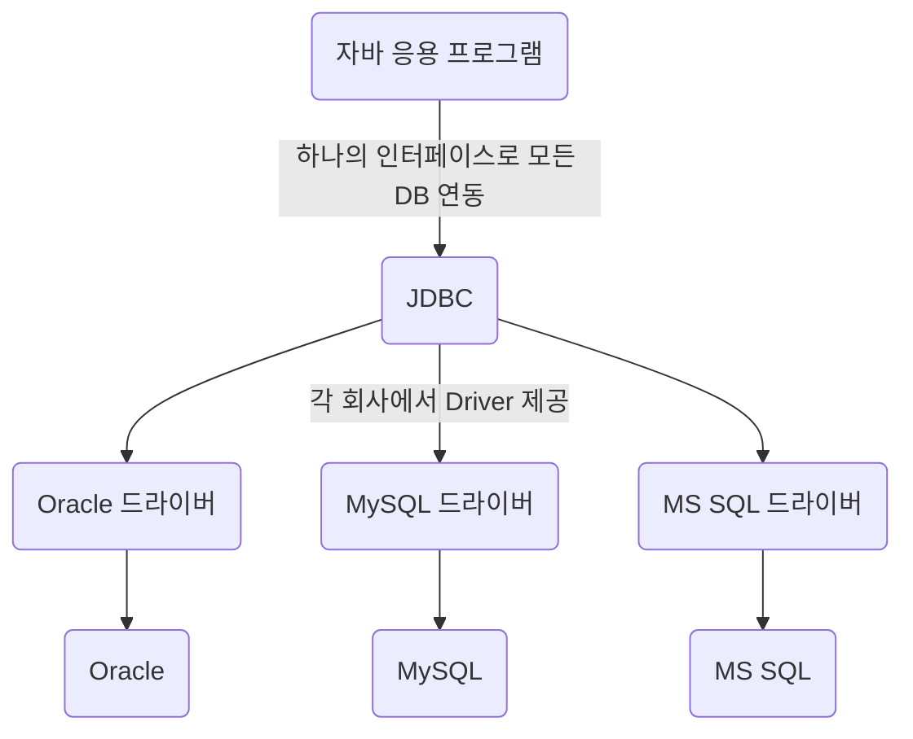

# JDBC (Java DataBase Connectivity)

* 자바 표준 인터페이스
  * DBMS 연동 
  * 작업(CRUD) : Query + UPDATE ...



* JDBC Driver의 종류
<table>
    <tr>
        <td>Type 1<td/>
        <td>ODBC 브릿지 Driver</td>
        <td>C언어 기반</td>
    </tr>
    <tr>
        <td>Type 2<td/>
        <td>Native API Driver</td>
        <td>C, C++ / Native Library 호</td>
    </tr>
    <tr>
        <td>Type 3<td/>
        <td>Network Protocol Driver</td>
        <td>순수 Java / Web Application 서버 미들웨어에 전달</td>
    </tr>
    <tr>
        <td>Type 4<td/>
        <td>DBMS Protocol Driver<br>Thin Driver</td>
        <td>순수 자바 / DBMS를 직접 호출, 드라이버 DB간 1:1 관계</td>
    </tr>
</table>


* DBMS 연결 순서
```java
Stirng url = "jdbc:oracle:thin:@localhost:1521:xe";
String user = "SCOTT";
String password = "tiger";
//1. JDBC Driver 로딩
Class.forName("oracle.jdbc.driver.OracleDriver");
//2. Connection 객체 생성 (Drivermanager 클래스)
cnn = getConnection(url, user, password);
//3. 작업 (CRUD / 질의 응답)
//...
//4. 연결 종료
cnn.close();
```


```java
Stirng url = "jdbc:oracle:thin:@localhost:1521:xe";
String user = "SCOTT";
String password = "tiger";
try{
Class.forName("oracle.jdbc.driver.OracleDriver");
cnn = getConnection(url, user, password);
while(rs.next()){
    int deptno = rs.getInt(1);
    String dname = rs.getString("dname");
    String loc = rs.getString("loc");
    
    System.out.printf("%d\t%s\t%s\n",deptno,dname, loc);			
}
cnn.close();
} catch (ClassNotFoundException e) {
    e.printStackTrace();
} catch (SQLException e) {
    e.printStackTrace();
} finally {
    try {
        stmt.close();
        //4. close
        conn.close();	
    } catch (SQLException e) {
        e.printStackTrace();
    }		
}
```
