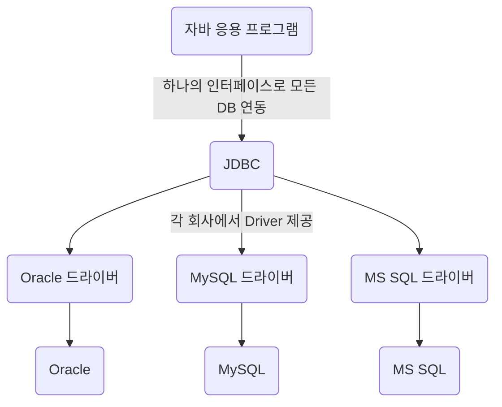

# JDBC (Java DataBase Connectivity)

* 자바 표준 인터페이스
  * DBMS 연동 
  * 작업(CRUD) : Query + UPDATE ...



* JDBC Driver의 종류
<table>
    <tr>
        <td>Type 1<td/>
        <td>ODBC 브릿지 Driver</td>
        <td>C언어 기반</td>
    </tr>
    <tr>
        <td>Type 2<td/>
        <td>Native API Driver</td>
        <td>C, C++ / Native Library 호</td>
    </tr>
    <tr>
        <td>Type 3<td/>
        <td>Network Protocol Driver</td>
        <td>순수 Java / Web Application 서버 미들웨어에 전달</td>
    </tr>
    <tr>
        <td>Type 4<td/>
        <td>DBMS Protocol Driver<br>Thin Driver</td>
        <td>순수 자바 / DBMS를 직접 호출, 드라이버 DB간 1:1 관계</td>
    </tr>
</table>


* DBMS 연결 순서
```java
Stirng url = "jdbc:oracle:thin:@localhost:1521:xe";
String user = "SCOTT";
String password = "tiger";
//1. JDBC Driver 로딩
Class.forName("oracle.jdbc.driver.OracleDriver");
//2. Connection 객체 생성 (Drivermanager 클래스)
cnn = getConnection(url, user, password);
//3. 작업 (CRUD / 질의 응답)
//...
//4. 연결 종료
cnn.close();
```


```java
Stirng url = "jdbc:oracle:thin:@localhost:1521:xe";
String user = "SCOTT";
String password = "tiger";
try{
Class.forName("oracle.jdbc.driver.OracleDriver");
cnn = getConnection(url, user, password);
while(rs.next()){
    int deptno = rs.getInt(1);
    String dname = rs.getString("dname");
    String loc = rs.getString("loc");
    
    System.out.printf("%d\t%s\t%s\n",deptno,dname, loc);			
}
cnn.close();
} catch (ClassNotFoundException e) {
    e.printStackTrace();
} catch (SQLException e) {
    e.printStackTrace();
} finally {
    try {
        stmt.close();
        //4. close
        conn.close();	
    } catch (SQLException e) {
        e.printStackTrace();
    }		
}
```
## Connection
* url, 계정, 비밀번호를 이요해 DB와 연결함
* 생성
    * DriverManger 클래스
```java
Connection connection = DriverManger.getConnection(url, user, password);
```
* createStatement()
  * 매개변수 : X
  * 리턴자료형 : Statement
  * SQLException 처리 필수

* 작업이 끝나고 close() 필수

## Statement
* 하나의 정적인 쿼리를 처리 가능
* 생성
  * Connection을 이용
```java
Statement statement = connection.createStatement()
```
* ResultSet executeQuery(String sql)
    * 매개변수 : String / 실행할 쿼리문(SELECT 문)
    * 리턴자료형 : ResultSet 
    * 매개변수로 입력된 쿼리문을 실행하여 한 레코드씩 ResultSet로 반환

```java
String sql = "SELECT * FROM emp";
ResultSet rs = statement.executeQuery(sql);
```

* int executeUpdate(String sql)
  * 매개변수 : String / 실행할 DML 문
  * 리턴자료형 : int
  * 매개변수로 입력된 INSERT, UPDATE, DELETE문 (DML 문)을 실행하고 반영된 레코드의 수를 반환
  * AutoCommit;
```java
String sql = "INSERT INTO dept VALUES (50, 'QC', 'SEOUL'";
int rowCount = statement.executeUpdate(sql);
```
* 작업이 끝나고 close() 필수

## ResultSet
* Statement에서 실행한 쿼리로 얻은 값을 저장하는 Set 
* next()
  * 매개변수 : X
  * 리턴값 : boolean
  * 저장한 행을 다음행으로 가리키고 있으면 True 없으면 False를 반환한다
* getXXX()
  * 매개변수 : String 컬럼명 / int 컬럼번호
  * 리턴값 : 각 자료형
  * 가리키고있는 행의 컬럼명이나 컬럼번호에 해당되는 데이터를 반환
