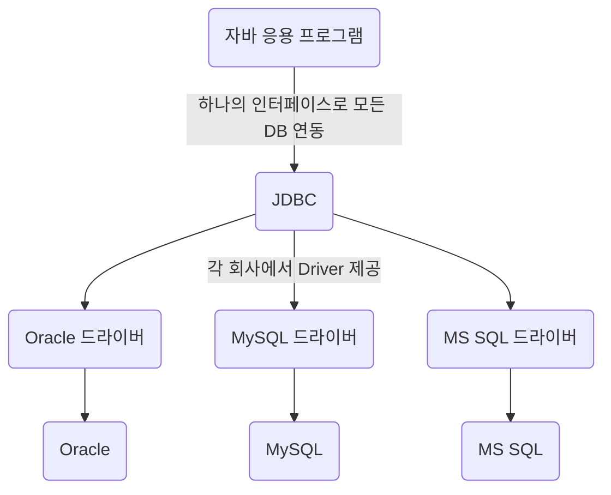
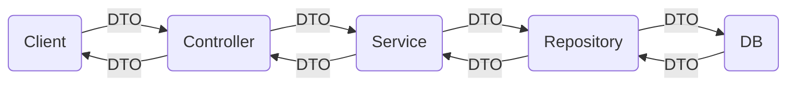

# JDBC (Java DataBase Connectivity)

* 자바 표준 인터페이스
  * DBMS 연동 
  * 작업(CRUD) : Query + UPDATE ...



* JDBC Driver의 종류
<table>
    <tr>
        <td>Type 1<td/>
        <td>ODBC 브릿지 Driver</td>
        <td>C언어 기반</td>
    </tr>
    <tr>
        <td>Type 2<td/>
        <td>Native API Driver</td>
        <td>C, C++ / Native Library 호</td>
    </tr>
    <tr>
        <td>Type 3<td/>
        <td>Network Protocol Driver</td>
        <td>순수 Java / Web Application 서버 미들웨어에 전달</td>
    </tr>
    <tr>
        <td>Type 4<td/>
        <td>DBMS Protocol Driver<br>Thin Driver</td>
        <td>순수 자바 / DBMS를 직접 호출, 드라이버 DB간 1:1 관계</td>
    </tr>
</table>


* DBMS 연결 순서
```java
Stirng url = "jdbc:oracle:thin:@localhost:1521:xe";
String user = "SCOTT";
String password = "tiger";
//1. JDBC Driver 로딩
Class.forName("oracle.jdbc.driver.OracleDriver");
//2. Connection 객체 생성 (Drivermanager 클래스)
cnn = getConnection(url, user, password);
//3. 작업 (CRUD / 질의 응답)
//...
//4. 연결 종료
cnn.close();
```


```java
Stirng url = "jdbc:oracle:thin:@localhost:1521:xe";
String user = "SCOTT";
String password = "tiger";
try{
Class.forName("oracle.jdbc.driver.OracleDriver");
cnn = getConnection(url, user, password);
while(rs.next()){
    int deptno = rs.getInt(1);
    String dname = rs.getString("dname");
    String loc = rs.getString("loc");
    
    System.out.printf("%d\t%s\t%s\n",deptno,dname, loc);			
}
cnn.close();
} catch (ClassNotFoundException e) {
    e.printStackTrace();
} catch (SQLException e) {
    e.printStackTrace();
} finally {
    try {
        stmt.close();
        //4. close
        conn.close();	
    } catch (SQLException e) {
        e.printStackTrace();
    }		
}
```
> ## Connection
* url, 계정, 비밀번호를 이요해 DB와 연결함
* 생성
    * DriverManger 클래스
```java
Connection connection = DriverManger.getConnection(url, user, password);
```
* createStatement()
  * 매개변수 : X
  * 리턴자료형 : Statement
  * SQLException 처리 필수

* 작업이 끝나고 close() 필수

> ## Statement
* 하나의 정적인 쿼리를 처리 가능
* 생성
  * Connection을 이용
```java
Statement statement = connection.createStatement()
```
* ResultSet executeQuery(String sql)
    * 매개변수 : String / 실행할 쿼리문(SELECT 문)
    * 리턴자료형 : ResultSet 
    * 매개변수로 입력된 쿼리문을 실행하여 한 레코드씩 ResultSet로 반환

```java
String sql = "SELECT * FROM emp";
ResultSet rs = statement.executeQuery(sql);
```

* int executeUpdate(String sql)
  * 매개변수 : String / 실행할 DML 문
  * 리턴자료형 : int
  * 매개변수로 입력된 INSERT, UPDATE, DELETE문 (DML 문)을 실행하고 반영된 레코드의 수를 반환
  * AutoCommit;
```java
String sql = "INSERT INTO dept VALUES (50, 'QC', 'SEOUL'";
int rowCount = statement.executeUpdate(sql);
```
* 작업이 끝나고 close() 필수

> ## ResultSet
* Statement에서 실행한 쿼리로 얻은 값을 저장하는 Set 
* next()
  * 매개변수 : X
  * 리턴값 : boolean
  * 저장한 행을 다음행으로 가리키고 있으면 True 없으면 False를 반환한다
* getXXX()
  * 매개변수 : String 컬럼명 / int 컬럼번호
  * 리턴값 : 각 자료형
  * 가리키고있는 행의 컬럼명이나 컬럼번호에 해당되는 데이터를 반환

> ## ResultSetMetaData
* 리플렉션 (reflection)
  * ResultSet로 받는 결과물에서 정보를 추출하는 것
* 생성
```java
ResultSet rs  = pstmt.excuteQuery();
ResultSetMetaData rsmd = rs.getMetaData();
```
* getColumnCount()
  * 매개변수 : x
  * 리턴값 : int
  * 기능
    * ResultSet이 갖고 있는 컬럼 수를 반환하는 메소드

* getColumnType()
  * 매개변수 : int index
  * 리턴값 : int
  * 기능
    * ResultSet에 index번째 컬럼의 타입을 반환한다
    * 반환하는 int는 oracle.jdbc.OracleTypes에 있는 상수와 같은 값

* 그 외
  * int getScale(int idx)
  * int getPrecision(int idx)
  * String getColumnTypeName(int idx)
  * String getColumnName(int idx)

> ## DTO (Data Transfer Object)
* 각 계층간 데이터 교환을 위해 사용하는 객체


* MVC 패턴에서 Model과 View를 분리하여 서로의 의존성을 낮추고, 독립적인 개발을 가능하게 함
```java
public class DTO {
    private Stirng name;
    private int age;
    private boolean gender;

    public DTO() {
        super();
    }

    public DTO()
}
```


> ## PreparedStatement
* 하나의 PreparedStatemetn 객체로 쿼리를 여러 번 처리할 수 있음
* 생성
```java
PreparedStatement pstmt = conn.prepareStatement(sql);
```
* 바인드 변수 : ?
  * sql문에 바인드 변수로 줄 부분에 ?
* setXXX()
  * 매개변수 : int i,  입력 값
  * 리턴값 : void
  * i번째 바인드 변수에 입력 값을 지정하는 메소드
* 사용
```java
Scanner sc = new Scanner(System.in);
int pdeptno = sc.nextInt();

PreparedStatement pstmt = conn.prepareStatement(sql);
pstmt.setInt(1,pdeptno);
ResrultSet rs = pstmt.executeQuery();
```

> ## CallableStatement
* 저장 프로시저를 호출하여 처리하는 스테이트먼트
* 생성
```java
CallableStatement cstmt = conn.prepareCall(sql);
```
* 사용
```java
Scanner sc = new Scanner(Sytem.in);
int deptno = sc.nextInt();
String dname = sc.next();

String sql = "{call 프로시저명(pdeptno => ?, pdname => ?)}";
CallableStatement cstmt = conn.prepareCall(sql);
cstmt.setInt(1, deptno);
cstmt.setString(2, dname);
int rowCount = cstmt.executeUpdate();

cstmt.close();
```

### 출력 매개변수
* 저장 프로시저에 출력 파라미터가 있을 때 받아오는 예
```sql
CREATE OR REPLACE PROCEDURE up_test
(
    pdeptno emp.deptno%TYPE, -- 입력 매개변수
    pcursor OUT SYS_REFCURSOR -- 출력 매개변수(커서)
)
IS
    vsql VARCHAR2(2000);
BEGIN
    vsql := 'SELECT * ';
    vsql := vsql || 'FROM emp ';
    vsql := vsql || 'WHERE dpetno = :pdeptno ';

    OPEN pcursor FOR vsql;
END;
```
```java
String sql = "{call up_test(pdeptno => ?, pcursor => ?)}";
CallableStatement cstmt = connection.prepareCall(sql);
cstmt.setInt(1, 10); //입력 파라미터 (10번 부서원)
cstmt.registerOutParameter(2, oracle.jdbc.OracleTypes.CUSOR);
// 2번째 바인딩 변수에 참조커서 타입으로 출력 파라미터를 받아오겠다는 코딩
cstmt.executeQuery();

ResultSet rs = (ResultSet) cstmt.getObject(2);
```
* resiterOutPrameter()
  * 매개변수 : int idx, int sqlType
  * 리턴값 : x(void)
  * 기능
    * 해당 스테이트먼트의 idx번째 바인딩 변수의 sqlType에 해당되는 타입의 출력 파라미터를 부여
  * int sqlType
    * oracle.jdbc.OracleTypes  추상 메소드 안에 상수 값을 이용
* 


> ## 트랜잭션 처리
* 오라클 &rarr; 하나의 프로시저 안 &rarr; 트랜잭션 처리
  * JAVA와 DB를 연동하여 호출할 때 &rarr; 트랜잭션 처리
* DML 문(INSERT, DELETE, UPDATE), ...&rarr; DB를 변화시키는 작업 단위
* 예
  * A &rarr; [100만원] &rarr; B
    1. A의 통장에서 100만원을 인출 (UPDATE)
    2. B의 통장에 100만원을 입금 (UPDATE)
    3. A와 B의 거리내역 추가 (INSERT)
    4. ...
  * 위와 같은 일련의 과정들은 한 번에 발생해야 함 / 하나의 단위 / 트랜잭션 
   
<table>
    <tr>
        <td>commit()</td>
        <td>커밋 처리<br>하나의 논리적인 작업 단위 모두 성공(완료) 시</td>
    </tr>
    <tr>
        <td>rollback()</td>
        <td>롤백 처리<br>하나의 논리적인 작업 단위 중 하나라도 실패(예외) 시</td>
    </tr>
    <tr>
        <td>setAutoCommit(boolean t) </td>
        <td>기본은 자동 커밋<br>자동 커밋 시 중간에 작업에서 예외 발생해도 그 전 작업은 커밋 됨<br>매개변수로 false &rarr; 자동커밋 해제</td>
    </tr>
</table>

```java
// 자동 커밋 해제
try{
    conn.setAutoCommit(false);
    // 1번 작업
    PreparedStatement pstmt = conn.prepareStatement(sql1);
    pstmt.executeUpdate();
    // 2번 작업
    pstmt = conn.prepareStatement(sql2);
    pstmt.executeUpdate();
    // 1 + 2 번 성공 시 커밋
    conn.commit();
} catch (SQLException e) {
    // 1, 2 번 중 한 군데서라도 예외 발생 시 롤백
    conn.rollback();
} finally {
     pstmt.close();
}
```
