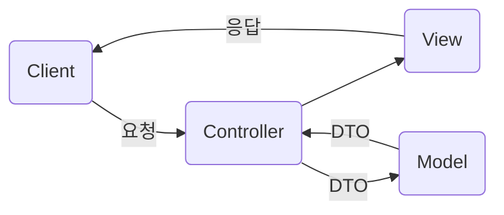

# MVC 패턴

## Model 영역
* 데이터베이스, 상수, 변수 등 초기 값
* 사용자가 편집하길 원하는 데이터

## View 영역
* UI와 같이, 출력을 담당하는 영역
* 정보를 저장해서는 안됨
  
## Controller 영역
* 모델과 뷰 간의 흐름을 관리하는 역할
* 사용자에게 요청을 받아 로직을 선택하고 호출
---
### MVC 모델의 장점
1. 분리된 영역의 작업을 진행하여 협업에 용이
2. 유지 보수 용이
3. 확장성 증가
4. 단위 테스트를 독립적으로 실행할 수 있음
