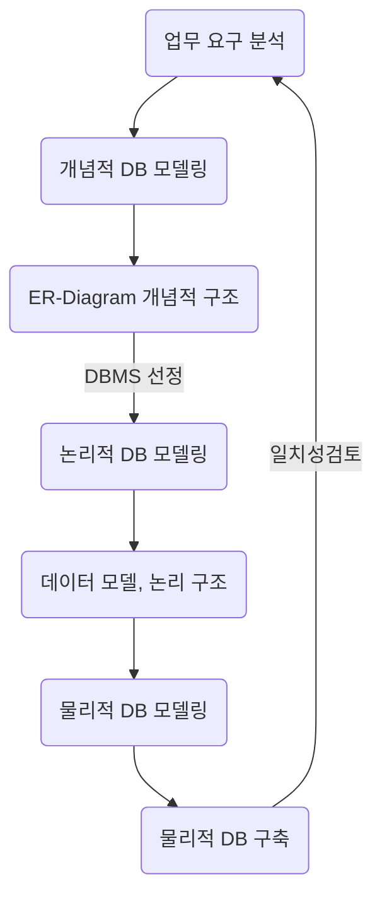
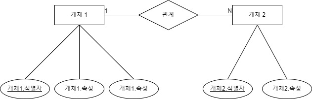

# 데이터 베이스 모델링 (DB modeling)

* 현실 세계의 업무적인 프로세스를 물리적으로 데이터베이스화 시키기 위한 과정

### DB 모델링 단계

|단계|내용|
|:---|:---|
|개념적 모델링|Entity, Attribute 추출 Entity 관계 정의 &rarr; ER-Diagram 작성|
|논리적 모델링|ER-Diagram을 Mapping rule에 의해  &rarr; 관계 스키마 설계 + 정규화|
|물리적 모델링|DBMS 선정  &rarr; 컬럼, 데이터타입, 인덱스 정의, 역정규화, ...  물리적 스키마 |

> ## 요구 분석
* 프로젝트 방향이 결정되는 중요한 단계
* 관련 분야 기본 지식 필요
* 데이터로 관리되어지는 항목 파악
* 백그라운드 프로세스 파악

>## 개념적 모델링

* 요구 분석 &rarr; Entity(개체) 추출 &rarr; Attribute(속성) 추출 &rarr; Entity(개체)의 Relationship(관계) 정의 &rarr;  

### Entity
* 개체 ( = 실체)
  * 업무 수행을 위해 데이터로 관리되어져야할 개체
  * 현실세계에 독립적으로 존재하는 식별 가능한 개체
  * 유형, 무형의 개체
* 개체는 **테이블**로 정의
  * 개체 파악 시, 관련 업무에 대한 지식이 중요

###  Attribute
* 속성
  * 개체에 대해 저장할 필요가 있는 정보
  * 개체의 성질, 분류, 수량, 상태, 특징, ...을 나타내는 세부 항목
* 속성은 **컬럼**으로 정의
  * 속성 설정 시, 관리 목적 / 활용 방향 중요

|속성 유형|내용|
|:---|:---|
|기초 속성|개체가 원래 갖고 있는 속성|
|추출 속성|기초 속성을 가공(계산)해서 얻을 수 있는 속성|
|설계 속성|실존하진 않고, 시스템의 효율을 위해 설계자가 임의로 부여한 속성|

* 속성 도메인 설정
  * 속성이 가질 수 있는 값들의 범위를 설정
    * 속성 이름
    * 자료형, 크기
    * 허용되는 값의 **제약조건**
    * 유일성
    * 초기 값
    * ...
  * 추후 개발 및 프로그램 구현 시 유용하게 사용

### Identifier
* 식별자
  * 각각의 인스턴스 구분할 수 잇는 단일 속성 or 속성 그룹
* 식별자가 없으면 데이터 수정/삭제가 원할하지 않음
* 식별자 종류

|식별자|내용|
|:---|:---|
|후보키 (Candidate Key)|개체를 구분할 수 있는 속성|
|기본키 (Primary Key)|후보키 중 가장 적합한 속성|
|대체키 (Alternate Key)|후보키 - 기본키 = 대체키|
|후보키 (Composite Key)|하나의 속성으로 기본키가 될 수 없는 경우 여러 속성을 묶어 식별자로 정의 먼저 오는 속성에 인덱스, 유일성이 적용|
|대리키 (Surrogate Key)|복합키를 대신할 식별자, 역정규화|

### Relationship
* 관계
  * 개체와 개체의 업무 연관성
* 관계도 속성을 가질 수 있음
  * 테이블로 정의
* 관계 대응 수

|관계|내용|
|:---|:---|
|1:1 관계|일 대 일 관계, 하나의 개체가 하나의 개체에 대응|
|1:N 관계|일 대 다 관계, 하나의 개체가 여러 개체에 대응|
|N:M 관계|다 대 다 관계, 여러개체가 여러 개체에 대응, 부모 테이블에 N으로 표기|

### ER-Diagram
* Entity(개체)Relationship(관계)-Daigram

|종류|기호|
|:---:|:---:|
|개체|사각형|
|속성|타원|
|식별자|언더라인|
|관계|마름모|

> ## 논리적 모델링

### 관계형 모델
* 부모 테이블과 자식테이블
  * 관계의 주체의 여부, 주체가 부모(Parent) 테이블
* 기본키(Primary Key)와 외래키(Foreign Key)
  * 식별관계 : 부모테이블 PK &rarr; 자식테이블 PK
  * 비식별관계 : 부모테이블 PK &rarr; 자식테이블 FK

### 정규화
* 의미
  * ER-Diagram &rarr; 관계 스키마 생성 과정에서
  * 함수적 종속성등의 종속성 이론을 이용해서
  * 잘못 설계된 관계 스키마를 더 작은 속성의 바람직한 스키마로 만드는 과정
* 목적
  * 데이터의 중복 제거
  * 데이터 관리 쉽게하기 위함
* 종류
<table>
    <tr>
        <td>종류</td>
        <td>내용</td>
    </tr>
    <tr>
        <td>제1정규화(1NF)</td>
        <td>모든 속성의 도메인이 원자 값(atomic value)으로만 구성되어 있으면 제 1정규형에 속함 반복되는 속성을 제거한 뒤 테이블에 기본키를 추가해 새로운 테이블 생성</td>
    </tr>
    <tr>
        <td>제2정규화(2NF)</td>
        <td>부분 함수적 종속성을 제거 부분 함수 종속성 : '복합키'에 전체적으로 의존하지 않는 속성</td>
    </tr>
    <tr>
        <td>제3정규화(3NF)</td>
        <td>이행 함수적 종속성을 제거 이행 함수 종속성 : 기본키가 아닌 키에 종속</td>
    </tr>
    <tr>
        <td>BCMF</td>
        <td>모든 결정자가 후보키</td>
    </tr>
    <tr>
        <td>제4정규화(4NF)</td>
        <td>다치 종속성관계를 제거 다치 종속 : 두 속성이 1:N관계로 대응되는 상황</td>
    </tr>
    <tr>
        <td>제5정규화(5NF)</td>
        <td>조인 종속성 : 연관성이 없는 조인이 단일 관계 엔티티에 있어 이상현상 발생</td>
    </tr>
</table>

### 함수의 종속성
 * 릴레이션에서 A 속성의 값이 각각에 대하여 시간 관계 없이 항상 B 속성의 값이 오직 하나만 연관되어 있는 것 
### 이상(anomaly) 현상
  * 삽입 이상
    * 릴레이션에 새 데이터를 삽입할 떄 불필요한 데이터도 함께 삽입해야 하는 문제
  * 수정 이상
    * 릴레이션에 데이터를 수정할 때 중복된 레코드 중 일부만 수정하여 데이터 불일치 발생되는 문제
  * 삭제 이상
    * 릴레이션에 데이터를 삭제할 때 꼭 필요한 데이터까지 연쇄 삭제되어 손실되는 문제

> ## 물리적 모델링
* DBMS의 특성에 맞게 실제 개체들을 정의하는 단계
* 사용량, 업무 프로세스 분석을 통해서  효율적인 DB 모델링
  * 인덱스 사용
  * 역정규화 수행

