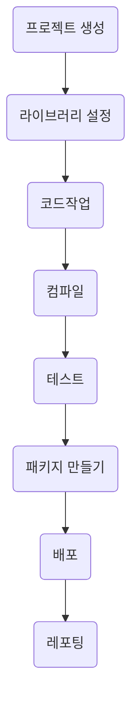

# 메이븐(Maven)

>## 빌드 도구

* 빌드 과정을 경량화하여 쉽게 구현할 수 있게하는 도구

### IDE vs 빌드 도구
* IDE
    * 컴파일러 + 탐색기 + 편집기 + 콘솔 + `빌드도구` + ...
    * 개발에 도움을 주는 통합환경
    * ex) 이클립스, 인텔리 제이, ...

* 빌드 도구
    * ex) Maven, Gradle, ...

