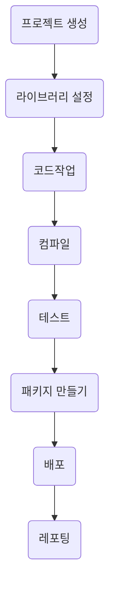

# 메이븐(Maven)
* 메이븐은 남이 만든 프로젝트를 이어서 만들 수 있다
>## 빌드 도구

* 빌드 과정을 경량화하여 쉽게 구현할 수 있게하는 도구

### IDE vs 빌드 도구
* IDE
    * 컴파일러 + 탐색기 + 편집기 + 콘솔 + `빌드도구` + ...
    * 개발에 도움을 주는 통합환경
    * ex) 이클립스, 인텔리 제이, ...

* 빌드 도구
    * ex) Maven, Gradle, ...

> ## 메이븐 명령어
### 프로젝트 생성
```console
mvn archetype:generate -DgroupId=org.dbck -DartifactId=javaprj -DarchetypeArtifactId=maven=archetype-quickstart
```
* archetype:generate
    * 해당 명령어를 통하여 프로젝트 생성


단게별 실행을 담당하는 플러그인들 >> mvn help:describe -Dcmd=compile 
페이즈 > 플러그인  > 골
골 ? 플러그인이 가지고 있는 하위 프로그램 
골이 실질적인 플러그인 역할을 한다
같은 플러그인을 사용하더라도 골이 다르다 > 컴파일  / 테스트 컴파일
작은 골들이 각 단계를 책임지는 실질적인 역할


컴파일 플러그인 설정
  <build>
    <plugins>
      <plugin>
        <artifactId>maven-compiler-plugin</artifactId>
        <version>3.8.1</version>
        <configuration>
          <source>1.8</source>
          <target>1.8</target>
        </configuration>
      </plugin>
    </plugins>
  </build>
빌드 설정하는 태그
빌드 설정중 플러그인을 설정하는 태그
플러그인 설정을 maven-compiler-plugin을 하고 
그 플러그인의 버전을 3.8.1로 하고
그 플러그인의 구성 설정을 소스, 타겟  JDK 버전을 1.8로 함

오버라이드가 됨? >> 이건 뭔말이야?


  <properties>
    <maven.compiler.source>1.8</maven.compiler.source>
    <maven.compiler.target>1.8</maven.compiler.target>
  </properties>
  로 설정할 수 있다


메이븐프로젝트를 이클립스에 임포트하기
메이븐의 빌드업 기능 + IDE의 편집기
메이븐의 빌드업기능과 IDE의 편집기 기능을 쓰는것이기 때문에 이클립스를 벗어나더라도 언제든지 프로젝트를 사용할 수 있다


메이븐 프로젝트를 웹 프로젝트로 바꾸기
1. <패키징>war</패키징>로 변경 > web.xml이 오길 기대함
2. webapp폴더 밑에 WEB-INF폴더 만듬
3. 그 밑에 원하는 톰캣 버전의 web.xml을 붙여넣기
>> <패키징>war</패키징>의 의미를 다시 생각해보기

> ## 라이브러리 설정하기
톰캣 안에 서블릿과 제이에스피를 실행하는데 필요한 라이브러를 포함하고 있따.

> ## 메이븐 저장소
* 메이븐이 운영하는 원격 저장소
* 플러그인을 다운로드
* 프ㅜㄹ러그인 뿐만아니라 라이브러리가 저장되어이쓴 ㄴ공간
수많으 아티팩트들이 저장되어있음 == 라이브럴리 + 프로젝트 모델
수많은 사용자들이 업로드해놓은 상태
프로젝트를 개발하겠따고할떄 직접구해서 자르파일을 섲러정했었는데 지금은 폼파일에서 설정하여 로컬 저장소로 가져오게된다.
하나는 자바프로젝트
하나는 웹프로젝트 
각각 필요한게 있으면 로컬로가져오고 중복되는게 있으면 같은 로컬저장소를 사용하기 때문에 여러프로젝트가 같이 사용한다.
로컬저장소 > 홈디렉토리 / .m2/repository

필요 종속 디펜던시들을 알아서 추가해줌
디펜던시 헤라키

> ## 메이븐 라이브러리 오류 문제
다운로드 중, 링크나 파일의 깨짐
로컬 리파지토리로의 파일을 다 지우고 다시 실행? 


> ## 만든 라이브러리 설치하기
프로젝트 개발할때 모든 라이브러리는 로컬 저장소에 있어야한다
프로젝트를 진행하다보면 라이브러리를  만들기도한다
내가 만든 라이브러리를 참조할떄는 만든 라이브러리를 

