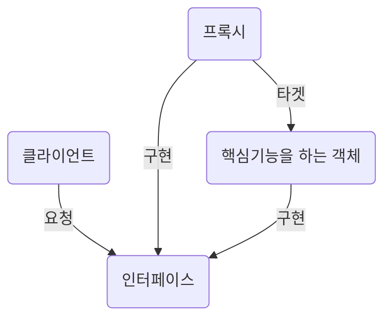

# 스프링 프레임워크
* 자바 기반의 웹 프레임워크


> ## POJO (Plain Old Java Object)
* `무거운 객체`를 만들어 코드의 가독성, 확장성, 유지보수가 떨어지는 단점을 보안하기 위해 등장한 개념
* EJB (EnterpriseJavaBeans)
  * `getter/setter`로 구성된 순수한 형태의 기본 클래스
```java
public class Score{
    private int kor;
    private int eng;
    private int mat;

    public int getKor() {return kor;}
    public void setKor(int kor) {this.kor = kor;}

    public int getEng() {return eng;}
    public void setEng(int eng) {this.eng = eng;}

    public int getMat() {return mat;}
    public void setMat(int mat) {this.mat = mat;}
}
```
* 조건
    1. 특정 규약(API)에 종속되지 않음
    2. 특정 환경에 종속되지 않음
    3. 객체 지향적 원리에 충실


> ## DI (DependencyInjection)
* 의존성 주입
* MVC 패턴과 같은 작업에서 많은 의존성 주입이 필요

### 강한 결합
* 객체를 다른 `객체 안`에서 생성하는 것은 강한 결합도(높은 의존성)를 가짐
* 하나의 객체의 변경 &rarr; 다른 객체의 변경

```java
public class RecordViewImpl implements RecordView{
    private RecordImpl record = new RecordImpl();
}
```


### 약한 결합
* `외부에서` 객체를 생성하여 객체를 주입
#### 생성자를 통한 주입
```java
public class RecordViewImpl implements RecordView{

    private RecordImpl record;
    //[생성자 DI(의존성 주입) 방식
    public RecordViewImpl(RecordImpl record){
        super();
        this.record= record;
    }
}
```
#### 프로퍼티를 통한 주입
```java
public class RecordViewImpl implements RecordView{
    //프로퍼티 방식
    public void setRecord(RecordImpl record){
        this.record = record;
    }
}
```   

> ## IoC (Inversion Of Control)
* 제어 역전
  * 스프링 프레임워크가 `개발자의 코드를 호출`

### Bean(빈) 객체
* 스프링 컨테이너가 관리하는 객체
  * 이 빈들을 관리하는 컨테이너를 `BeanFactory`라고 함

### BeanFactory
* Bean 관리(생성, 조회, 반환)

### ApplicationContext
* Bean 관리(생성, 조회, 반환)
* BeanFactory에서 부가기능을 추가
  * 국제화가 지원하는 텍스트 메시지 관리
  * 이미지 등 파일 자원을 로드할 수 있음
  * 리스너로등록된 빈에게 이벤트 발생을 알림

## 1. XML파일로 빈 객체 생성 설정
```xml
<?xml version="1.0" encoding="UTF-8"?>
<beans xmlns="http://www.springframework.org/schema/beans"
       xmlns:xsi="http://www.w3.org/2001/XMLSchema-instance"
       xsi:schemaLocation="http://www.springframework.org/schema/beans
           http://www.springframework.org/schema/beans/spring-beans-3.0.xsd">

    <bean id="record" class="di.RecordImpl"></bean>

    <bean id="rvi" class="di.RecordViewImpl">
        <constructor-arg ref="record"></constructor-arg>
    </bean>

</beans>
```
* class 속성으로 풀네임을 줘 빈 객체를 id속성의 명을 가진 빈 객체를 생성
```xml
<bean id="record" class="di.RecordImpl"></bean>
```
* 생성자를 통한 주입
* 빈 객체 생성 후 constructor-arg 태그로 의존성 주입 
1. ref 속성 
```xml
<bean id="rvi" class="di.RecordViewImpl">
    <constructor-arg ref="record"></constructor-arg>
</bean> 
```
2. ref 태그 
```xml
<bean id="rvi" class="di.RecordViewImpl">
    <constructor-arg>
        <ref bean="record"/>
    </constructor-arg>
</bean>
```
* 프로퍼티를 통한 주입
  * setter 메소드명의 'set'을 생략하고 첫 글자를 소문자로 바꿈
```xml
<bean id="rvi" class="di.RecordViewImpl">
    <property name="record" ref="record"></property>
</bean>
```
### 호출
```java
class Test {
    public static void main(String[] args) {
        String resourceLocations = "applicationContext.xml";
        
        GenericXmlApplicationContext ctx = new GenericXmlApplicationContext(resourceLocations);

        RecordViewImpl rvi = (RecordViewImpl) ctx.getBean("rvi");
    }
}
```
* 위에서 만든 `applicationContext.xml` xml 파일로 `GenericXmlApplicationContext` 객체 생성 하여 스프링 컨테이너 안에 Bean 객체 생성
* .getBean() : 생성된 빈 객체를 호출


## 2. 자바코딩과 어노테이션을 이용한 객체 주입 설정
### 설정
#### Config.java
```java
import org.springframework.context.annotation.Bean;
import org.springframework.context.annotation.Configuration;

@Configuration
public class Config {

    RecordImpl record = new RecordImpl();

    @Bean 
    public RecordImpl record() {
        return new RecordImpl();
    }

    @Bean(name = "rvi")
    public RecordViewImpl getRecordViewImpl() {
        RecordViewImpl rvi = new RecordViewImpl();
        rvi.setRecord(record()); // setter 프로퍼티를 통해서 DI
        return rvi;
    }
}
```
* @Configuration 어노테이션으로 빈 객체 생성 클래스로 설정
* @Bean 어노테이션으로 빈 객체 생성 설정
    * @Bean(name="빈객체명")

### 호출
#### main 메소드
```java
        AnnotationConfigApplicationContext ctx = new AnnotationConfigApplicationContext(Config.class);
        RecordViewImpl rvi = ctx.getBean("rvi", RecordViewImpl.class);
```
* 위에서 만든 `Config.java`에서 어노테이션 설정
  * `AnnotationConfigApplicationContext` 객체 생성 시 해당 .class파일 설정 하여 IoC컨테이너 생성 &rarr; 빈 객체 생성 주입하는 코딩

## 3. 빈 객체 자동 생성 및 연결
### 설정
#### applicationContext.xml
```xml
<context:component-scan base-package="스캔할 패키지명"></context:component-scan>
```
* 컨테이너 설정 파일인인 .xml에 `context:component-scan`태그로 스캔할 패키지명 설정
  * `context:annotation-config`태그는 자동 연결하는 태그이나 위 태그 하나로 처리 가능

#### RecordImpl.java
```java
@Component
public class RecordImpl implements Record{
    //
}
```
#### RecordViewImpl.java
```java
@Component
public class RecordViewImpl implements RecordView{
    @Autowired
    private RecordImpl record = null;
    public RecordViewImpl(RecordImpl record){this.record= record;}
    public void setRecord(RecordImpl record){this.record = record;}
}
```
* @Component 어노테이션으로 빈 객체 자동 생성 대상으로 지정
  * ("이름")으로 이름 지정
* @Autowired를 의존성 주입되는 부분에 설정하여 자동 주입 대상으로 지정
### 호출
```java
    String resourceLocations = "applicationContext.xml";
    GenericXmlApplicationContext ctx = new GenericXmlApplicationContext(resourceLocations);
    RecordViewImpl record = (RecordViewImpl)ctx.getBean("recordViewImpl");
```

> ## AOP (Apect Oriented Programming)
* 관점 지향 프로그래밍
* 모듈에서 사용하는 공통적인 기능을 분리
    1. 스프링 프레임워크 : DI, AOP
    2. 스프링 시큐리티 : 세션 (인증 권한)
    3. 스프링 배치 : 페이지 모듈화
    4. 스프링 인터그레이션 : 시스템간 연동을 위한 메시징 프레임워크
    5. 스프링 소셜 : 소셜 네트워크 연동
    6. ...
* 모듈은 상속/구현 관계 없이, 기능을 분리하여 관리하기 위함


<table>
    <tr>
        <td>Aspect</td>
        <td>핵심기능을 제외하고 공통의 기능</td>
    </tr>
    <tr>
        <td>Advice</td>
        <td>Aspect이 실행되는 위치를 구현한 것</td>
    </tr>
    <tr>
        <td>Jointpoint</td>
        <td></td>
    </tr>
    <tr>
        <td></td>
        <td></td>
    </tr>
    <tr>
        <td></td>
        <td></td>
    </tr>
</table>


### 프록시 패턴




* CGlib proxy
  * 특정 메소드만 프록시화
