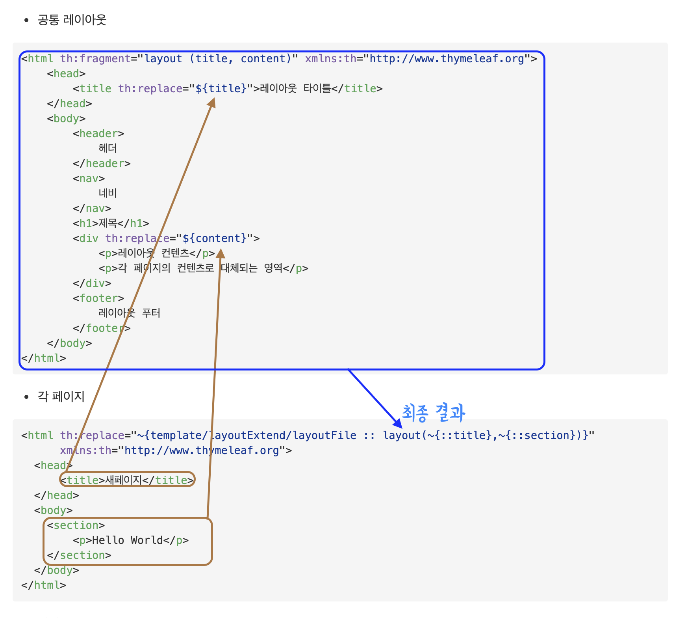

# 타임리프

## 서버 사이드 렌더링(SSR)
* jsp 같이 서버에서 동적으로 HTML의 정보를 렌더링하기 위함

## 네츄럴 템플릿
* 타임리프는 HTML 태그를 유지한 상태
* 태그의 속성으로 타임리프 문법을 적용
* HTML을 직접 열어도 브라우저가 속성을 인식하지 못한 상태로 태그를 유지하며 열림

## 타임리프 선언
```html
<html xmlns:th="http://www.thymeleaf.org">
</html>
```

## 텍스트
```html
<!--타임리프-->
<span th:text="${data}"></span>
<span> [[${data}]]</span>

<!--렌더링 결과-->
<span>data 어트리뷰트에 할당된 내용</span>
<span>data 어트리뷰트에 할당된 내용</span>
```
* 기본적으로 이스케이프 th:text는 이스케이프 처리가 되어 `<` `>`는 HTML엔티티로 렌더링 된다

```html

<!--타임리프-->
<span th:text="${data}"></span>
<span> [[${data}]]</span>
<span th:utext="${data}"></span>
<span> [(${data})]</span>

<!--어트리뷰트로 "<b>Hello</b>이 있을 떄 렌더링 결과-->
<span>&lt;b&gt;Hello&lt;/b&gt;</span>
<span>&lt;b&gt;Hello&lt;/b&gt;</span>
<span><b>Hello</b></span>
<span><b>Hello</b></span>
```
* 여러 태그들이 들어가면 혼란이 있을 수 있기 떄문에, 기본적으로는 이스케이프 처리를 하는 th:text를 사용해야 한다


## 변수
* `SpringEL`표현식을 사용하여 변수를 표현할 수 있음

```java
${data}
```

* Object의 프로퍼티 접근법
  * member.id
  * member.['id']
  * member.getId()
    * 모두 `member`의 `id`필드를 조회하는 표현식

* List 컬렉션의 요소 접근
  * list[0]
    * `list`의 `0번째 요소` 조회하는 표현식

* Map 컬렉션의 밸류 접근
  * map['memberA']
    * `map`의 `memberA`의 밸류를 조회하는 표현식

#### 지역변수
* `th:with`로 지역변수 선언

## 기본 객체

<table>
<tr>
    <td>HttpServletRequest</td>
    <td>${#request}</td>
</tr>
<tr>
    <td>HttpServletResponse</td>
    <td>${#response}</td>
</tr>
<tr>
    <td>HttpSession</td>
    <td>${#session}</td>
</tr>
<tr>
    <td>ServletContext</td>
    <td>${#sevletContext}</td>
</tr>
<tr>
    <td>Locale</td>
    <td>${#locale}</td>
</tr>
</table>

* 파라미터 접근
  * 파라미터 접근은 기본적으로 `HttpServletRequest`객체에서 getParameter()로 접근해야하 함
  * ${param.파라미터명}

* 세션 접근
  * ${session.세션명}

  *스프링빈 접근
  * ${@member.getId()}

#### 유틸리티 객체
* 문자, 숫자, URI를 편리하게 나타내기 위한 유틸리티 객체 
  * #객체명
  * message / uris / dates(java.util.Dte) / calendars / temporals(java8날짜) / numbers / objects / strings / bools / arrays / lists / sets / maps / ids


## URL
* `href, src, ...` 같은 속성에 들어갈 URL 생성
* `@{url/{경로변수}(쿼리 파라미터 or 경로 변수)}`
```html
<!-- 파라미터 : "param1"="aaa", "param2"="bbb" -->

<a th:href="@{/hello}"></a>
<!--href=/hello"-->

<a th:href="@{/hello(param1=${param1}, param2=${param2})}"></a>
<!--href=/hello?param1=aaa&param2=bbb"-->

<a th:href="@{/hello/{param1}/{param2}(param1=${param1}, param2=${param2})}"></a>
<!--href=/hello/aaa/bbb"-->

<li><a th:href="@{/hello/{param1}(param1=${param1}, param2=${param2})}"></a>
<!--href=/hello/aaa?param2=bbb"-->
```

## 리터럴(고정된 값)
* 문자 / 숫자 / 불리언 / null
* 문자 리터럴
  * `'~'(작은 따옴표)`를 통해서 나타타냄
  * 띄어쓰기가 없는 경우는 하나의 토큰으로 인식하여, 생략 가능
  * 리터럴 대체 문법
    * `|~|`를 사용

```html
<!-- 파라미터 : "param1" = "AAA">
<span th:text="aaa"></span> <!-- aaa -->
<span th:text="aaa bbb"></span> <!-- 에러 -->
<span th:text="'aaa bbb'"></span> <!-- aaa bbb -->
<span th:text="'aaa' + ${param1}"></span> <!-- aaa AAA -->
<span th:text="|aaa ${param1}|"></span> <!-- aaa AAA --> 
```

## 연산
* 비교 연산자
  * \> : gt
  * < : lt
  * \>= : ge
  * <= : le
  * ! : not
  * == : eq
  * != : neq
    * `>`,`<`와 같이 HTML 엔티티를 사용해야될 때 주의 필요

* 조건식(3항 연산자)
  * (조건식)?값1:값2
  * 조건이 참이면 값 1
  * 조건이 거짓이면 값 2
* Elvis 연산자
  * (값1):?(값2) 
    * 값1이 널이면 값 2가 출력
* No-Operation
  * (값):?_ 
    * 값이 널이면 타임리프 적용 X

## 속성 관련
* 기본적으로 `th`속성을 이용하여 속성을 새로 만들거나 대체
  * ex : th:name="dooboo" &rarr; name="dooboo"
* 추가
  * th:classappend를 사용하여 해당 태그의 클래스를 추가 가능
  * attrappend, attrpreppend를 통하여 특정 속성의 값을 추가 가능
* checked
  * th:checked="true" 로 체크드속성 추가
    * checked속성은 기본적으로 밸류를 갖지 않음
  

## 반복문
* `th:each="파라미터1, 파라미터2 : ${컬렉션}" `
  * `${컬렉션}` List, Map(엔티티가 담김), Iterable 구현 객체, Enumeration 구현 객체, Array 의 요소를 하나씩 꺼냄
  * 파라미터1 : 꺼낸 요소의 값
  * 파라미터2 : 반복 상태
    * 생략 시 `파라미터1의 명 + Stat`으로 자동 생성
    * index : 0~
    * count : 1~
    * size : 전체 크기
    * even, odd, first, last : 홀, 짝, 첨, 막 (불리언 값)


## 조건문
* `th:if="${불리언 값을 나타내는 조건}"`
  * `true`면 태그를 렌더링하고
  * `false`면 태그를 렌더링하지 않음
  * `th:unless`는 그 반대
* `th:switch="${판별할 값}"`
  * `th:case="값"` 의 값과 일치할 떄 태그 렌더링
  * `th:case="*"` 는 모든 케이스에 해당 안될 떄 표시

## 주석
* 파서 주석
  * 웹 브라우저에서 아예 보이지 않는 `타임리프의 주석`
```html
<!--/* 내용 */-->
<!--/*--> 내용 <!--*/-->
```
* 프로토타입 주석
  * HTML 주석이 감싸고 있기 떄문에 타임리프 렌더링을 거친 후에만 내용이 브라우저로 렌더링됨
```html
<!--/*/ 내용 /*/-->
```


## 블럭
* `<th:block></th:block>` 타임리프에서 제공하는 가상(?)의 태그
  * 주로 특정 영역에 반복문, 조건문 같은 내용을 적용하기 위해서 사용한다

&rarr; 입력
```html
<th:block th:each="user : ${users}">
  <li th:text="${user.username}"></li>
</th:block>
```
&rarr; 결과
```html
<li>hawn</li>
<li>dooboo</li>
<li>cookie</li>
```


## 자바스크립트 인라인
* `<script>`태그 안에서 타임리프를 그대로 사용하면
  * 여러가지 문제점들이 발생
```javascript
var name = [[${user.username}]];
//var name = "dooboo";가 아니라
//var name = dooboo;로 렌더링 되어 에러

var user = [[$user]];
//var user = Controller.User(username=dooboo, age=5);로 렌더링 되어 에러
```

* `<script th:inline="javascript">`를 적용
  * 스크립트 태그 안에서 타임리프가 자바스크립트에 맞게 적적히 렌더링을 해줌
  * 주석을 이용해 `내추럴 템플릿` 가능
  * 적절히 반복문 같은 기능도 사용하면 유용

```html
<script th:inline="javascript">

var name = [[${user.username}]];
//var name = "dooboo";로 렌더링

var user = [[$user]];
//var user = {"username":"dooboo","age":5};
//JSON객체로 변환

var natural = /*[[${user}]]*/ "타임리프 미적용 시 이 문구로 렌더링"

[# th:each="user, userStat : ${users}]
var user[[${userStat.count}]] = [[${user}]];
[/]
//var user1 = {"username":"hwan","age":29};
//var user2 = {"username":"dooboo","age":5};
//var user3 = {"username":"cookie","age":6};

</script>
```


## 템플릿
#### 조각
* `th:fragment`로 조각으로 선언
  * `th:fragment="header"`로 "header"라는 조각등록
  * `th:fragment="headerParam(param1, param2)"` 파라미터 값을 포함하는 조각 등록
* 부분 포함
  * `th:replace="~{경로 :: 조각명(파라미터 값, 파라미터 값)}"` 
    * 해당 태그를 조각으로 완전히 대체시킴
  * `th:insert="~{경로 ::조각명}"`
    * 해당 태그 안에 조각을 삽입

#### 레이아웃
1. 웹 어리케이션의 `공통 레이아웃`이 되는 레이아웃 html을 작성
2. 각 페이지에서 `각 컨텐츠`영역의 태그 작성
3. `~{::태그명}` 태그를 파라미터로 전달

* 공통 레이아웃
```html
<html th:fragment="layout (title, content)" xmlns:th="http://www.thymeleaf.org">
    <head>
        <title th:replace="${title}">레이아웃 타이틀</title>
    </head>
    <body>
        <header>
            헤더
        </header>
        <nav>
            네비
        </nav>
        <h1>제목</h1>
        <div th:replace="${content}">
            <p>레이아웃 컨텐츠</p>
            <p>각 페이지의 컨텐츠로 대체되는 영역</p>
        </div>
        <footer>
            레이아웃 푸터
        </footer>
    </body>
</html>
```
* 각 페이지
```html
<html th:replace="~{template/layoutExtend/layoutFile :: layout(~{::title},~{::section})}"
      xmlns:th="http://www.thymeleaf.org">
  <head>
      <title>새페이지</title>
  </head>
  <body>
    <section>
        <p>Hello World</p>
    </section>
  </body>
</html>
```



* 결과
```html
<html>
    <head>
        <title>새페이지</title>
    </head>
    <body>
        <header>
            헤더
        </header>
        <nav>
            네비
        </nav>
        <h1>제목</h1>
        <section>
          <p>Hello World</p>
        </section>
        <footer>
            레이아웃 푸터
        </footer>
    </body>
</html>
```

# 스프링과 통합
## \<form>관련
* `form 태그`에 `th:object`를 통하여 커맨드 객체 지정
* `th:field="*{필드명}"`로 필드 지정
  * id 속성 필드명으로 지정
  * name 속성 필드명으로 지정
  * value 속성 필드값으로 지정
* 장점
  * html 속성으로 바로 코딩하면 오타 발생 시, 에러X 바인딩X의 문제가 있음
  * `th:field`에서 필드명 오타 발생 시, 에러 발생으로 디버깅 장점
  * 수정 기능과 같은 경우, 바로 value 속성 지정됨

```java
@Getter
public class Member{
  private String name;
  private int age;
}
```

```html
<!--렌더링 전-->
<form th:action th:object="${member}">
  <label for="name">이름</label>
  <input type="text" th:field="*{name}">
  <label for="age">나이</label>
  <input type="text" th:field="*{age}">
</form>

<!--렌더링 후-->
<form action="">
  <label for="name">이름</label>
  <input type="text" id="name" name="name" value="">
  <label for="age">나이</label>
  <input type="text" id="age" name="age" value="">
</form>
```

## 체크박스
* \<input>태그 중, `checkbox` 체크하고 submit 시 값이 'on'으로 넘어감
  * 'on'으로 넘어온 값은, 스프링이 `true`로 변환
* 체크 하지 않고 submit 시 파라미터가 아예 안넘어감
  * 파라미터가 아예 안넘어감으로 `null`
  * \<input type="hidden" name="_필드명" value="xxxx"> 같이 `_필드명`의 값이 있고, `필드명`에 해당되는 파라미터가 없으면, 스프링이 `false`로 변환
  * `th:field`사용하면 `_필드명` 인풋 히든 자동으로 렌더링

```html
<!--렌더링 전-->
<div th:each="pet : ${pets}">
  <input type="checkbox" th:field="*{pets}" th:value="${pet.key}">
  <label th:for="${#ids.prev('pets')}" th:text="${pet.value}">..</label>
</div>

<!--렌더링 후-->
<div>
  <input type="checkbox" id="pets1" name="pets" value="DOG">
  <input type="hidden" name="_pets" value="on">
  <label for="pets1">강아지</label>
</div>
<div>
  <input type="checkbox" id="pets2" name="pets" value="CAT">
  <input type="hidden" name="_pets" value="on">
  <label for="pets2">고양이</label>
</div>
<div>
  <input type="checkbox" id="pets3" name="pets" value="ECT">
  <input type="hidden" name="_pets" value="on">
  <label for="pets3">기타</label>
</div>

<!--
  아무 것도 체크 안할 시 : _pet=on에 의해서 pets=[] 빈배열 넘어감
-->
```

## 라디오버튼
```html
<!--렌더링 전-->
<div th:each="pet : ${pets}">
  <input type="radio" th:field="*{pets}" th:value="${pet.key}">
  <label th:for="${#ids.prev('pets')}" th:text="${pet.value}">..</label>
</div>

<!--렌더링 후-->
<div>
  <input type="radio" id="pets1" name="pets" value="DOG">
  <label for="pets1">강아지</label>
</div>
<div>
  <input type="radio" id="pets2" name="pets" value="CAT">
  <label for="pets2">고양이</label>
</div>
<div>
  <input type="radio" id="pets3" name="pets" value="ECT">
  <label for="pets3">기타</label>
</div>
<!--
  라디오버튼은 _pet 히든태그 만들지 않음 체크 안할 시 null로 넘어감
-->
```

## 셀렉트
```html
<!--렌더링 전-->
<select th:field="*{pets}">
  <option value="">==반려동물==</option>
  <option th:each="pet : ${pets}" th:value="${pet.key}" th:text="${pet.value}">..</option>
</select>

<!--렌더링 후-->
<select id="pets" name="pets">
  <option value="">==반려동물==</option>
  <option value="DOG">강아지</option>
  <option value="CAT">고양이</option>
  <option value="ECT">기타</option>
</select>
```