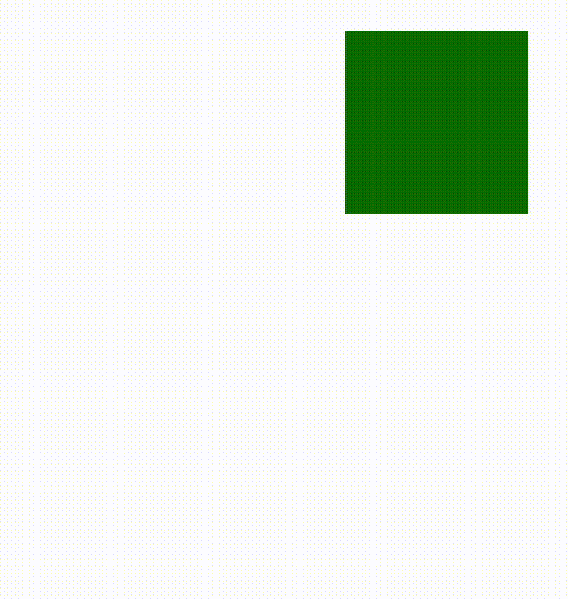

# CSS 

* Cascading Style Sheets
* html의 요소가 표시되는 방법, 문서의 스타일을 지정하는 언어


> ## 형식
* \<head>의 \<style> 태그 안에서 선언
* .css 파일을 stylesheet로 \<link>로 연결해서 사용
```css
선택자 {
  속성 : 값;
  속성 : 값;
  ...
}
/* 선택자를 여러 개 줄 수 있음*/
선택자1, 선택자2 {
  속성 : 값;
  속성 : 값;
}
```
## 선택자
<table>
<thead>
	<th>종류</th>
	<th>표현</th>
	<th>설명</th>
</thead>
<tr>
	<td>전체</td>
	<td>*</td>
	<td>html문서 내에 모든 요소에 적용하기 위한 선택자</td>
</tr>
<tr>
	<td>태그</td>
	<td>태그명</td>
	<td>선택한 태그 모두에 적용하는 선택자</td>
</tr>
<tr>
	<td>ID</td>
	<td>#아이디명</td>
	<td>해당 id명을 갖는 요소에 스타일 적용</td>
</tr>
<tr>
	<td>Class</td>
	<td>.클래스명</td>
	<td>해당 class에 해당되는 요소들에 스타일 적용</td>
</tr>
<tr>
	<td rowspan="4">복합</td>
	<td>요소.클래스명</td>
  <td>해당 요소 중 클래스명이 일치하는 요소들에 스타일 적용</td>
</tr>
<tr>
	<td>조상선택자 후손선택자</td>
	<td>조상 선택자에 후손 요소들 중 후손선택자와 일치하는 요소에 스타일 적용</td>
</tr>
<tr>
	<td>부모선택자 > 자식선택자</td>
	<td>부모 선택자에 자식 요소중 자식 선택자와 일치하는 요소에 스타일 적용</td>
	<td></td>
</tr>
<tr>
	<td>형제요소 +(~) 형제요소</td>
	<td>인접(+)하거나 형제되는(~)요소를 선택</td>
</tr>
<tr>
	<td>가상 클래스</td>
	<td>요소:가상클래스</td>
	<td>해당되는 요소의 특정 상태나 구조적으로 특정 요소에만 스타일을 적용</td>
</tr>
</table>


### 가상 클래스 

<table>

<thead><tr><td colspan="2">동적 선택자</td></tr></thead>
<tr>
	<td>:link</td>
	<td>방문하지 않은 상태의 링크</td>
</tr>
<tr>
	<td>:visited</td>
	<td>이미 방문한 링크</td>
</tr>
<tr>
	<td>:hover</td>
	<td>해당 요소에 마우스가 올라온 상태</td>
</tr>
<tr>
	<td>:active</td>
	<td>해당 요소가 선택된 상태/td>
</tr>
<tr>
	<td>:focus</td>
	<td>해당 요소에 포커스된 상태</td>
</tr>
<thead><tr><td colspan="2">구조 가상 클래스</td></tr></thead>
<tr>
	<td>:nth-child(n)</td>
	<td>부모의 n번째 자식 중 일치하는 요소</td>
</tr>
<tr>
	<td>:nth-of-type(n)</td>
	<td>부모의 타입이 일치하는 자식 중 n번째 요소</td>
</tr>
<tr>
	<td>:first-child</td>
	<td>첫번쨰 자식 요소</td>
</tr>
<tr>
	<td>:last-child</td>
	<td>마지막 자식 요소</td>
</tr>
<thead><tr><td colspan="2">가상 요소</td></tr></thead>
<tr>
	<td>::before</td>
	<td>해당 요소 앞 공간을 선택</td>
</tr>
<tr>
	<td>::after</td>
	<td>해당 요소 뒤 공간을 선택</td>
</tr>
<thead><tr><td colspan="2">부정 선택자</td></tr></thead>
<tr>
	<td>:not()</td>
	<td>()의 선택자를 제외하고 선택</td>
</tr>
</table>

### 속성 선택자

### 인라인 CSS 적용 방법 
  * 해당 요소의 sytle 속성으로 적용
```html
<div style="background-color:red;"></div>
```

> ## CSS 우선순위

<table>
	<tr>
		<th>종류</th>
		<th>점수</th>
		<th>내용</th>
	</tr>
	<tr>
		<td>!important</td>
		<td>-</td>
		<td>인라인 스타일을 무시하는 예외</td>
	</tr>
	<tr>
		<td>인라인 css</td>
		<td>1000점</td>
		<td>태그 안에서 style요소로 주는 경우, 우선 순위가 가장 높음 </td>
	</tr>
	<tr>
		<td>id 선택자</td>
		<td>100점</td>
		<td>id명(#) 선택자로 준 CSS</td>
	</tr>
	<tr>
		<td>class 선택자</td>
		<td>10점</td>
		<td>class명(.) 선택자로 준 CSS</td>
	</tr>
	<tr>
		<td>의사 클래스</td>
		<td>10점</td>
		<td>(:의사클래스)어떤 요소의 특정 상황에 스타일을 주는 가상 클래스</td>
	</tr>
	<tr>
		<td>태그 선택자</td>
		<td>1점</td>
		<td>태그명을 선택자로 준 CSS</td>
	</tr>
	<tr>
		<td>의사 요소</td>
		<td>1점</td>
		<td>(::의사요소)요소의 특정 부분에 스타일을 적용하기 위해 주는 가상의 요소</td>
	</tr>
	<tr>
		<td>*</td>
		<td>0점</td>
		<td>html 내 모든 요소에 스타일을 적용, 우선 순위가 가장 낮음</td>
	</tr>
</table>


```css
div{} /* 1점 */
div p{} /* 1 + 1 = 2점 */
.myClass{} /* 10점 */
div#myId{} /* 1 + 100 = 101점 */
div{color:red !important;} /* 최우선 */
```

> ## 색 지정

1. 표준 색상명 (140개)
2. rgb(0~255,0~255,0~255)
   - red/green/blue 색의 3원소
3. #rrggbb	
   - HEX == 16진수
4. rgba(0~255,0~255,0~255,alpha 투명도 0.0~1.0)
5. hsl 
	- hue(색조) 0~360 : 0(빨강) / 120(초록) / 240(파랑) 
	- saturation(채도) 0~100% 
	- lightness(밝기) 0(검정)~100(흰색)%
```css
선택자 {
  
  속성 : red;
  
  속성 : #rrggbb;
  
  속성 : rgb(255,255,255);
  
  속성 : rgba(255,255,255,0.5);
  
  속성 : hsl(0,100%,50%);
}
```

> ## display 속성
### inline 모드
* 앞, 뒤 개행 X
* 다른 요소들과 한 라인에 배치
* Content가 차지하는 양만큼만 공간 차지
* inline 요소
  * \<span>
  * \<a>
  * \<button>
  * ...

### block 모드
* 앞, 뒤 개행 O
* 다른 요소들과 다른 라인에 배치
* block의 높이, 너비, 안/밖의 여백을 줄 수 있음
  * 높이 속성 : height
  * 너비 속성 : width
  * 안쪽 여백 : padding
  * 바깥 여백 : margin
* block  요소
  * \<div>
  * \<p>
  * \<h1>~\<h5>
  * ...

### none
* 해당 컨텐츠를 보여지 않게 함
* visibility:hidden과 차이
  * diplay:none; - 콘텐츠가 차지하는 공간을 없앰
  * visbility:hiddenl - 콘텐츠가 차지하는 공간을 유지하고 보이지만 않음

> ## 박스 모델 (box model)


* Content
  * 실질적인 내용을 담고 있는 영역
  * width
    * 너비
    * 기본 값 : 부모의 너비
  * height
    * 높이
    * 기본 값 : 콘텐츠의 양
* padding  
  * 안쪽 여백
    * 컨텐츠(텍스트, 이미지, ...)와 영역 사이에 간격
* border 
  * 테두리
* margin
  * 바깥 여백
    * 요소 영역 바깥쪽으로 갖는 여백


> ## float 속성


<table>
    <caption>플로팅 관련 속성</caption>
    <tr>
        <td>float</td>
        <td>'뜨다'라는 의미<br>요소를 플로팅해서 어디에 보여줄 지를 결정</td>
    </tr>
    <tr>
        <td>overflow</td>
        <td>float된 요소가 부모 요소의 영역보다 클 때, 흘러 넘치는 상황에서 어떻게 보여줄 지 결정</td>
    </tr>
    <tr>
        <td>clear</td>
        <td>해당 위치에 부유를 제거하여 float된 요소 다음에 오는 요소가 float요소 밑에 깔리지 않게 하는 속성</td>
    </tr>
</table>


* float(둥둥 뜨다)
* 요소의 위치, 레이아웃을 배치하기 위해 사용
* 값
  * none : 기본 값
  * left : 띄운 요소를 왼쪽에 배치
  * right: 띄운 요소를 오른쪽에 배치

### 문제점
1. float 속성을 사용
2. 컨테이너의 height이 기본값이면 컨텐츠의 양만큼 지정
3. 컨텐츠들이 다 float되면 overflow발생

#### &rarr; 해결
1. 컨테이너에 overflow속성을 auto나 hidden을 줘서 넘친 속성만큼 컨테이너의 높이를 줘야 함
2. 의사 요소(::before  / :: after)에 clear속성을 준다
 
 


### 이미지 플로팅
* \에 style 속성의 float 값
* 부모 태그의 영역에서 위치할 곳을 지정

<p style="border:1px solid; padding">
	
	Lorem ipsum dolor sit amet, consectetur adipisicing elit, sed do eiusmod tempor incididunt ut labore et dolore magna aliqua. 
</p>
<p style="border:1px solid;">
	
	Lorem ipsum dolor sit amet, consectetur adipisicing elit, sed do eiusmod tempor incididunt ut labore et dolore magna aliqua. 
</p>

```html
<!-- style 속성으로 적용 -->
<p style="border:1px solid;">
	
	Lorem ipsum dolor sit amet, consectetur adipisicing elit, sed do eiusmod tempor incididunt ut labore et dolore magna aliqua. 
</p>
<p style="border:1px solid;">
	
	Lorem ipsum dolor sit amet, consectetur adipisicing elit, sed do eiusmod tempor incididunt ut labore et dolore magna aliqua. 
</p>
```

> ## overflow 속성


> ## 반응형 웹
* 다양한 장치에서 페이지를 보기 좋게 디자인하는 것
### 뷰포트 (ViewPort)
  * \<meta name="viewport" content="width=device-width, initial-scale=1.0">
  * width=device-width
    * 디바이스의 너비로 너비를 맞춤
  * initial-scale=1.0
    * 초기 화면 배율을 설정
    * 0.0~1.0의 백분율

### 반응형 텍스트 크기
* vw(viewport width)
  * 1vw == 뷰포트의 1%
    * 뷰포트 50cm의 1vw == 0.5cm

### 미디어 쿼리
* 미디어 쿼리를 이용해서 화면 조건에 따라 다른 레이아웃 표현
* @media 조건 {}
  * 조건
    * min-width : 최소 너비
    * max-width : 최대 너비
    * only screen : 화면에 표시될 때만 적용

```CSS
nav {
  float : left;
  width : 20%;
}
article {
  float : left;
  width : 60%
}
aside {
  float : left;
  width : 20%;
}
@media only screen and (max-width:600px){
  nav, article{
    width : 100%
  }
  aside{
    display : none;
  }
}
```
* 600px 이상에서


* 600px 이하에서


>## position

<table>
<tr>
	<th>속성 값</th>
	<th>배치</th>
</tr>
<tr>
	<td>static</td>
	<td>기본값<br>정적 / top,left,... 속성 적용 불가</td>
</tr>
<tr>
	<td>relative</td>
	<td>상대 좌표<br>기준 위치</td>
</tr>
<tr>
	<td>absolute</td>
	<td>절대 좌표<br>가장 가까운 relative 부모 요소를 기준(0px,0px)으로 배치</td>
</tr>
<tr>
	<td>fixed</td>
	<td>고정<br>화면에 고정된 위치에 배치</td>
</tr>
<tr>
	<td>sticky</td>
	<td>사용자의 스크롤 위치에 따라 배치</td>
</tr>
</table>


>## 정렬
### 수직 정렬
1. 블럭 모드를 컨테이너에 대하여 가운데 정렬
```css
div{
  margin: 0 auto;
  /* left, right 마진을 자동으로줘서 가운데 정렬*/
}
```
2. 텍스트를 가운데 정렬
```css
p{
  text-align: center;
  /* 요소 안의 텍스트를 가운데 정렬 */
}
```

---
# background 속성

> ## background-image
* 특정 이미지를 배경으로 사용하는 속성
* 여러 이미지를 사용할 수 있음
* 속성
  * background-size : 이미지 사이즈를 정함
  * background-position : 이미지가 시작하는 위치를 정함
  * background-repeat : 이미지를 반복할지 결정

```css
div{
	background: url("나무 이미지 경로") left top no-repeat
				, url("꽃 이미지 경로") right bottom no-repeat
				, url("종이 이미지 경로") left top repeat;
				
	background-size: 50px 150px, 130px, auto;
}
```


### background-size
* contain
  * 이미지가 요소를 넘치지 않을 정로도만 크게 유지
* cover
  * 이미지의 세로나 가로가 꽉 차도록 이미지를 크기 조절
    * 세로 비율이 짧은 이미지라면, 세로가 꽉 차는 크기
    * 가로 비율이 짧은 이미지라면, 가로가 꽉 차는 크기

### background-origin
* 배경 이미지의 영역을 지정
* 속성 값
  * padding-box : 패딩 왼쪽상단 (기본값)
  * border-box : 테두리 왼쪽 상단
  * content-box : 콘텐츠 왼쪽 상단
* background-clip 은 배경색이 칠해질 영역에 대한 속성

### gradient 효과
* 색의 부드러운 전환
* 속성 값
  * 선형 그라데이션
    * linear-gradient(방향, 색상 %, 색상 %, ...)
  * 방사형 그라데이션
    * radial-gradient(모양, 색상 %, 색상 %, ...)

> ## 이미지 스프라이트
* 하나의 이미지에 여러 이미지 모음
* 서버에서 이비리를 로드하는 횟수를 줄여 성능을 향상

* 네이버에서 사용하는 이미지 스프라이트


```html
<style>
  div {
    /* 1. 이미지를 표현하고자하는 사이즈 */
    width: 222px;
    height: 52px;

    /* 2. 이미지 스프라이트르 배경이미지로 지정 */
    background-image:url("https://s.pstatic.net/static/www/img/uit/sp_main_dba1af.png");

    /* 3. 표현하려는 크기와 실제 이미지파일의 사이즈 비교하여 사이즈 지정  */
    background-size: 457px; /* 50% :원본 914px*/
    
    /* 4. 사용하려하는 이미지의 시작 좌표만큼 이미지 포지션을 잡음 */
    background-position: 0 -158px;
    
    background-repeat: no-repeat;
  }
</style>
<body>
  <div></div>
</body>
```


---
# 텍스트

* 기본
  * 요소보다 텍스트가 길어지면 개행
  * 단어 단위로 개행

### word-wrap 속성
* 단어가 요소 밖으로 overflow될 때, 줄을 바꿀 지 지정
* 속성 값
  * normal : 기분 줄바꿈
  * break-word : overflow가 발생하는 단어를 잘라서 줄 바꿈

### white-space
* 공백 문자 처리
* 속성 값
  * normal : 연속 공백을 하나로 합침, 자동 개행
  * nowrap : 연속 공백을 하나로 합침, <br>태그에서만 개행

### text-overflow
* overflow된 텍스트 표시 여부
* 속성 값
  * clip : 기본 값
  * ellipsis : 잘린 텍스를 '...'으로 표시

---
# 폰트

>## @font-face
1. 클라이언트(브라우저)에 설치 되지 않은 폰트
2. 웹 폰트로 지정
3. 페이지 로드 시, 자동으로 서버에서 폰트 로드
4. 클라이언트 폰트 사용

```css
@font-face{
	font-family: myFirstWebFont;
	src:url("../images/sansation_bold.woff");
	font-weight: bold;
}

*{
	font-family: myFirstWebFont;
}
```

---
# transform

> ## 요소 이동

* translate()
  * translateX()
  * translateY()

```css
#id1{transform : translate(50px, 100px);}
/* 요소를 x축으로 50px y축으로 100px만큼 이동 */

#id2{transform : translate(-50%, 50%);}
/* 요소를 x축으로 요소 너비의 50프로만큼 -방향으로 이동*/
/* 요소를 y축으로 요소 높이의 50프로만큼 +방향으로 이동 */

```

> ## 요소 회전

* rotate()
  * rotateX()
  * rotateY()
* rotate3d()

```css
#id1{transform : rotate(20deg);}
/* 요소를 시계방향으로 20도 만큼 회전 */
```

> ## 요소 크기 변경

* scale()
  * scaleX() : 너비 
  * scaleY() : 높이
* scale3d()

```css
#id1{transform : scale(1.5);}
/* 요소의 크기를 1.5배만큼 변경 */
```

> ## 요소 기울이기
* skew()
  * skewX()
  * skewY()

```css
#id1{transform : skew(20deg, 10deg);}
/* x축에 대하여 20도만큼 기울이기 */
/* y축에 대하여 10도만큼 기울이기 */

#id2{transform : skew(20deg);}
/* == transform:skew(20deg, 0); */
```

---
# transition

* 전환
* 요소의 속성 값이 변할 때, 속도나 시간을 지정하여 자연스러운 효과를 줌
* 속성
	* transition-delay 속성 
    	* 전환 전, 딜레이
	* transition-duration 속성
    	* 전환되는 시간
	* transition-property 속성
    	* 어떠한 속성이 변할 때, 전환효과를 줄 지 지정
	* transition-timing-function 속성
    	* 전환 속도 유형을 정함
    	* ease : 천천히 &rarr; 빨리 (기본값)
    	* linear : 등속
    	* ease-in : 천천히 시작
    	* ease-out : 천천히 끝
    	* ease-in-ou : 천천히 &rarr; 천천히

---
# animation
* 요소를 어떤 스타일 &rarr; 다른 스타일로 점차적으로 변환하는 애니메이션 속성


> ## @keyframes Rule
* 애니메이션 속성에 의해 요소가 점차적으로 변하는 스타일을 지정
* 특정 시간에 요소가 가지는 스타일을 지정
* 시작 
  * 0% {}
  * from {}
* 끝
  * 100% {}
  * to {}
* 중간
  * n% {}

> ## animation 속성
* 애니메이션을 줄 요소에 지정하는 속성
### animation-name
* @keyframse의 요소가 가지는 스타일을 가져옴
### animation-duration
* 애니메이션 한 사이클의 시간을 지정
### animation-timing-function
* 애니메이션의 전환 속도를 결정
	* ease : 천천히 &rarr; 빨리 (기본값)
	* linear : 등속
	* ease-in : 천천히 시작
	* ease-out : 천천히 끝
	* ease-in-ou : 천천히 &rarr; 천천히
### animation-delay
* 애니메이션 시작 시간 지연
### animation-iteration-count
* 반복 횟수 결정
  * infinite 값 줄 시, 계속 반복
### animation-fill-mode
* 시작 전이나 종료 후 상태 결정
### animation-direction
* alternate : 0% &rarr; 100% &rarr; 0% ... 번갈아
* reverse : 역방향
* normal
* alternate-reverse 

```css
div{
	width: 100px;
	height:100px;
	background:red;

	animation-name : example;
	animation-duration : 4s;
	animation-timing-function : linear;
	animation-iteration-count:infinite;
	animation-direction:alternate; 

	position: relative;
}

@keyframes example{
	0% {background-color:red; left: 0; top: 0;}
	50% {background-color:green; left: 200px; top: 0;}
	100% {background-color:blue; left: 200px; top: 200px;}
}
```

