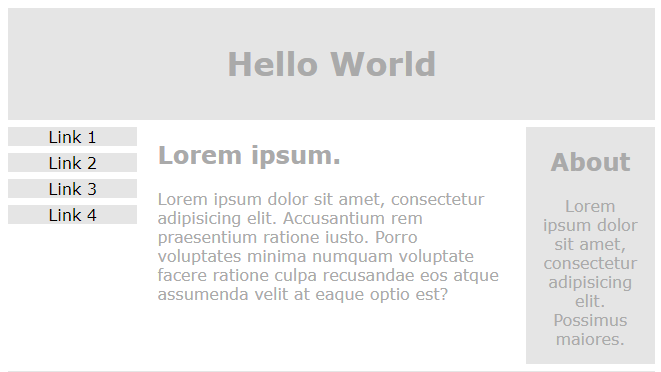

# CSS

> ## 선언 방식
* \<style> 태그 안에서 선언
```css
선택자 {
  속성 : 값;
  속성 : 값;
  ...
}
/* 선택자를 여러 개 줄 수 있음*/
선택자1, 선택자2 {
  속성 : 값;
  속성 : 값;
}
```

* 선택자명:hover 
  * 마우스 올렸을 때의 상태를 지정
* 선택자명:nth-child()
  * ()안에 숫자 &rarr; 부모의 n번째 자식 요소 적용
  * ()안에 odd,even &rarr; 부모의 홀수, 짝수 번째 자식  요소 적용
* 선택자명:nth-of-type()
  * 같은 유형의 n번째에 적용

>## 속성 종류

<table>
<tr>
  <td>border</td>
  <td>경계선</td>
</tr>
<tr>
  <td>width</td>
  <td>너비를 지정<br>기본 값은 부모 너비의 100%</td>
</tr>
<tr>
  <td>height</td>
  <td>높이를 지정<br>기본 값은 컨텐츠의 양에 따라 결정/지정하면 고정</td>
</tr>
<tr>
  <td>padding</td>
  <td>해당 요소의 안쪽 여백을 지정</td>
</tr>
<tr>
  <td>background-color</td>
  <td>해당 요소의 배경 색을 지정</td>
</tr>
<tr>
  <td>background-image</td>
  <td>해당 요소의 배경 이미지를 지정<br>url('이미지 경로')</td>
</tr>
</table>

> ## 색 지정
```css
선택자 {
  /* 16진수, 2자리 수 마다 rgb값을 나타냄 (0~255)*/
  색에 대한 속성 : #rrggbb;
  /* 0~255값으로 rgb 값 표현 */
  색에 대한 속성 : rgb(255,255,255);
  /* 0~255값으로 rgb 값 표현 + a는 투명도 0(불투명)~1(투명)*/
  색에 대한 속성 : rgba(255,255,255,0.5);
}
```

> ## display 속성
### inline 모드
* 앞, 뒤 개행 X
* 다른 요소들과 한 라인에 배치
* Content가 차지하는 양만큼만 공간 차지
* inline 요소
  * \<span>
  * \<a>
  * \<button>
  * ...

### block 모드
* 앞, 뒤 개행 O
* 다른 요소들과 다른 라인에 배치
* block의 높이, 너비, 안/밖의 여백을 줄 수 있음
  * 높이 속성 : height
  * 너비 속성 : width
  * 안쪽 여백 : padding
  * 바깥 여백 : margin
* block  요소
  * \<div>
  * \<p>
  * \<h1>~\<h5>
  * ...


> ## 박스 모델 (box model)


* Content
  * 실질적인 내용을 담고 있는 영역
  * width
    * 너비
    * 기본 값 : 부모의 너비
  * height
    * 높이
    * 기본 값 : 콘텐츠의 양
* padding  
  * 안쪽 여백
    * 컨텐츠(텍스트, 이미지, ...)와 영역 사이에 간격
* border 
  * 테두리
* margin
  * 바깥 여백
    * 요소 영역 바깥쪽으로 갖는 여백


> ## 이미지 플로팅
* \에 style 속성의 float 값
* 부모 태그의 영역에서 위치할 곳을 지정

<p style="border:1px solid; padding">
	
	Lorem ipsum dolor sit amet, consectetur adipisicing elit, sed do eiusmod tempor incididunt ut labore et dolore magna aliqua. 
</p>
<p style="border:1px solid;">
	
	Lorem ipsum dolor sit amet, consectetur adipisicing elit, sed do eiusmod tempor incididunt ut labore et dolore magna aliqua. 
</p>

```html
<!-- style 속성으로 적용 -->
<p style="border:1px solid;">
	
	Lorem ipsum dolor sit amet, consectetur adipisicing elit, sed do eiusmod tempor incididunt ut labore et dolore magna aliqua. 
</p>
<p style="border:1px solid;">
	
	Lorem ipsum dolor sit amet, consectetur adipisicing elit, sed do eiusmod tempor incididunt ut labore et dolore magna aliqua. 
</p>
```

<table>
    <caption>플로팅 관련 속성</caption>
    <tr>
        <td>float</td>
        <td>'뜨다'라는 의미<br>이미지를 플로팅해서 어디에 보여줄 지를 결정</td>
    </tr>
    <tr>
        <td>overflow</td>
        <td>플로팅된 이미지가 부모 요소의 영역보다 클 때, 흘러 넘치는 상황에서 어떻게 보여줄 지 결정</td>
    </tr>
</table>


> ## 반응형 웹
* 다양한 장치에서 페이지를 보기 좋게 디자인하는 것
### 뷰포트 (ViewPort)
  * \<meta name="viewport" content="width=device-width, initial-scale=1.0">
  * width=device-width
    * 디바이스의 너비로 너비를 맞춤
  * initial-scale=1.0
    * 초기 화면 배율을 설정
    * 0.0~1.0의 백분율

### 반응형 텍스트 크기
* vw(viewport width)
  * 1vw == 뷰포트의 1%
    * 뷰포트 50cm의 1vw == 0.5cm

### 미디어 쿼리
* 미디어 쿼리를 이용해서 화면 조건에 따라 다른 레이아웃 표현
* @media 조건 {}
  * 조건
    * min-width : 최소 너비
    * max-width : 최대 너비
    * only screen : 화면에 표시될 때만 적용

```CSS
nav {
  float : left;
  width : 20%;
}
article {
  float : left;
  width : 60%
}
aside {
  float : left;
  width : 20%;
}
@media only screen and (max-width:600px){
  nav, article{
    width : 100%
  }
  aside{
    display : none;
  }
}
```
* 600px 이상에서


* 600px 이하에서


