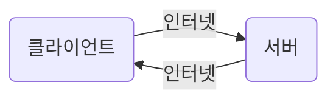
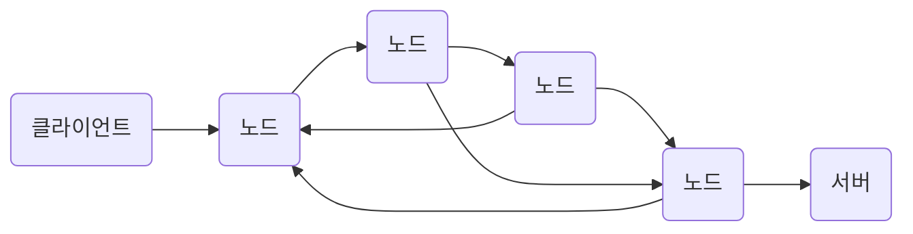
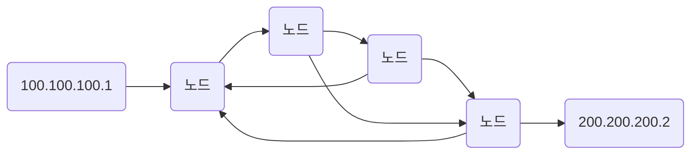

# HTTP

* 웹 기술은 HTTP 기반으로 이루어짐

> ## 인터넷 네트워크

### 인터넷 통신

* 복잡한 인터넷 망

### IP(인터넷 프로토콜)

* 지장한 IP주소에 데이터 전달
  * 클라이언트가 IP주소 부여
  * 요청을 받는 서버도 IP주소 있어야 함

#### IP패킷

1. 애플리케이션영역에서 생성된 `전송할 데이터`와
2. `출발지 IP`, `목적지 IP`, 기타...

* 한계
    1. 비연결셩 : 통신하는 대상 여부와 상관없이 전송
    2. 비신뢰성 : 패킷이 중간(네트워크 어딘가)에서 사라지거나, 순서가 바뀔 수 있음
    3. 프로그램 구분 : 같은 IP에서 애플리케이션 구분 불가 &rarr; 포트로 해결

