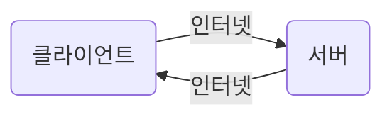
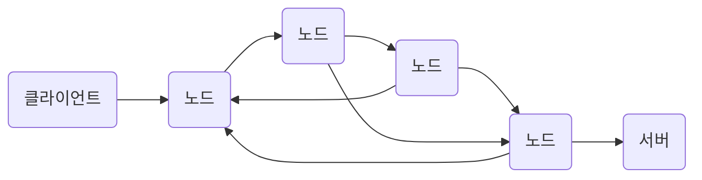
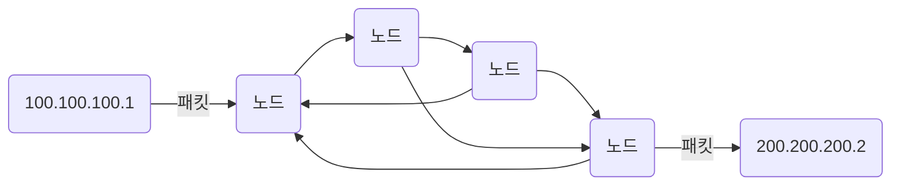
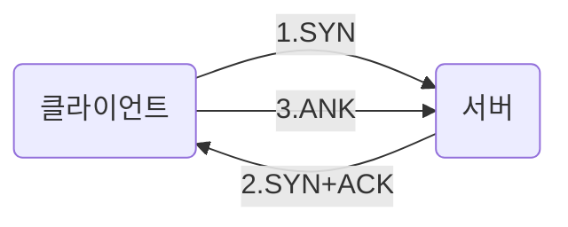
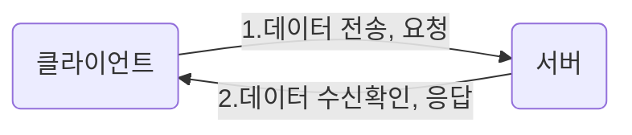
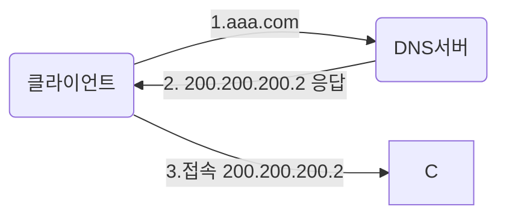

# HTTP

[`김영한님`의 인프런 강의 -모든 개발자를 위한 HTTP 웹 기본 지식](https://www.inflearn.com/course/http-%EC%9B%B9-%EB%84%A4%ED%8A%B8%EC%9B%8C%ED%81%AC/dashboard)를 통해 학습한 내용을 정리한 파일

---
* 웹 기술은 HTTP 기반으로 이루어짐

> ## 인터넷 네트워크

### 인터넷 통신

* 복잡한 인터넷 망

### IP(인터넷 프로토콜)

* 지장한 IP주소에 데이터 전달
  * 클라이언트가 IP주소 부여
  * 요청을 받는 서버도 IP주소 있어야 함

#### 패킷

* 패키지 + 버킷

1. 애플리케이션 영역에서 생성된 `전송할 데이터`와
2. `출발지 IP`, `목적지 IP`, 기타...

* 한계
    1. 비연결셩 : 통신하는 대상 여부와 상관없이 전송
    2. 비신뢰성 : 패킷이 중간(네트워크 어딘가)에서 사라지거나, 순서가 바뀔 수 있음
    3. 프로그램 구분 : 같은 IP에서 애플리케이션 구분 불가 &rarr; 포트로 해결

### 인터넷 프로토콜 4계층

<table>
    <tr>
        <td>계층</td>
        <td>프로토콜</td>
        <td>전송</td>
    </tr>   
    <tr>
        <td>어플리케이션 계층</td>
        <td>HTTP, FTP</td>
        <td>DATA, 메세지 생성</td>
    </tr>
    <tr>
        <td>전송 계층</td>
        <td>TCP, UDP</td>
        <td>세그먼트</td>
    </tr>
    <tr>
        <td>인터넷 계층</td>
        <td>IP(IPv4, IPv6)</td>
        <td>패킷</td>
    </tr>
    <tr>
        <td>네트워크 인터페이스</td>
        <td>LAN, 이더넷</td>
        <td>프레임, 비트</td>
    </tr>
</table>

### TCP
1. 연결 지향
    * 3 way handshake

  * 물리적으로 연결되어 있는지 확인 X &rarr; `논리적`으로 연결되어있다고 판단
    * SYN : 연결 수락
    * ACK : 요청 수락

2. 데이터 전달 보증

3. 순서 보장
    * 패킷의 순서가 다르게 도착하면 재요청
      * 1, 2, 3으로 전송 &rarr;  1, 3, 2로 도착
      * 2부터 다시 보내달라 응답

### UDP
* 거의 기능이 없음
* IP와 유사
  * \+ PORT + 체크섬 + ...
* HTTP/3에서 사용
* TCP는 이미 짜여져있는 부분이 커서 기능 개선이 어려운 반면, UDP는 기능 개선의 여지가 있음

### PORT
* `같은 IP 주소에서 둘 이상의 연결`이 있을 때..
  * ex. 하나의 컴퓨터에서 게임을 들으면서 보이스톡을 하는 경우..
* 패킷 정보
  * 출발지 PORT
  * 목직지 PORT
  * ...

### DNS
* 네트워크로 통신하기 위해선 IP가 필요
  * IP는 기억하기 어렵움
  * IP는 변경이되면 알 수 없음

* Domain Name System
  * IP 주소를 나타내는 도메인 명
  * DNS 서버에 등록
  * 도메인 명을 IP로 변환하여 접속

<table>
    <tr>
        <td colspan=2 align=center>DNS서버</td>
    </tr>
    <tr>
        <td>도메인 명</td>
        <td>IP</td>
    </tr>
    <tr>
        <td>aaa.com</td>
        <td>200.200.200.2</td>
    </tr>
    <tr>
        <td>bbb.com</td>
        <td>210.210.210.3</td>
    </tr>
    <tr>
        <td colspan=2 align=center>:</td>
    </tr>
</table>

