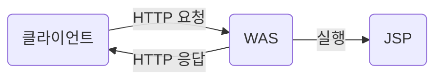

# JSP (Java Server Pages)
* `동적 웹 페이지`[(링크)](./WEB.md)의 사용되는 자바의 표준 기술
* 서버단에서 로직 등을 통하여 웹 페이지를 동적으로 조작
* HTML 응답을 생성하는 기능 제공
### WAS
* Web Application Server
  * 톰캣, 제티, ...
* `동적인 컨텐츠`의 로직 처리를 하기 위함

1. HTTP 요청 : http://localhost:8080/test.jsp
2. 실행 : jsp의 java 코드 등을 컴파일 후 실행
3. HTTP 응답

# JSP 구성 요소
> ## Directive(디렉티브)
* 지시자
* JSP 페이지에 대한 설정 정보를 지정할 떄 사용
1. <%@ page %> : page 지시자
2. <%@ taglib %> : taglib 지시자
3. <%@ include %> : include 지시자

> ## Script(스크립트)
* 문서의 내용을 동적으로 생성하기 위해 사용
  * 폼에 입력한 정보를 서브밋 하여 데이터베이스에 저장
  * 데이터베이스의 데이터를 읽어오기
### Scriptlet(스크립트릿)
* <% %>
* JAVA 코드를 실행하는 요소

### Expression(표현식)
* <%= %>
* 변수에 입력된 값 등을 출력하는 요소

### Declaration(선언부)
* <%! %>
* 변수, 메소드 선언하는 요소

> ## Expression Languge(표현 언어)
### 형식
* `${표현식}`의 형태
  * 정해진 문법을 따르는 표현식을 입력하여 기능 실행
* 코드를 간결하게하여 이해하기 좋게 만듦

> ## 기본 객체
* JSP가 어플리케이션 기능 구현에 필요한 기능을 제공하는 기본 객체
### request
* 클라이언트의 요청 정보를 저장하는 객체
* 메소드
  * getParameter(String name)
    * 해당 파라미터의 값을 받아오는 메소드 / 없을 시 null

# Form
> ## \<form>\</form>

* html 태그
* 웹 페이지의 입력 양식을 의미
* 요소
  * name 
    * 폼의 이름
    * 데이터의 이름으로 지정
  * action
    * 데이터가 전송되는 백엔드 URL 
  * method
    * get : 쿼리스트링 &rarr; ?name속성값=입력값&...
      * 보안 취약
      * 기본 값
    * post : http 내부 저장 전송
      * 보안 안정적

> ## \<input>\<input>

* 입력하기 위한 태그
* 요소
  * type
    * 입력 종류 
    * 텍스트, 버튼, ...
  * name
    * 데이터 이름
  * value
    * 기본 값
<table>
    <caption>input type 종류</caption>
    <tr>
        <td>submit</td>
        <td>< form > 요소의 데이터를 서버로 전송</td>
    </tr>
    <tr>
        <td>reset</td>
        <td>< form > 의 데이터 초기화</td>
    </tr>
    <tr>
        <td>text</td>
        <td>문자 입력</td>
    </tr>
    <tr>
        <td>button</td>
        <td>버튼 형식</td>
    </tr>
    <tr>
        <td>radio</td>
        <td>라디오버튼 name속성이 같은 버튼끼리 그룹</td>
    </tr>
    <tr>
        <td>checkbox</td>
        <td>체그박스 name속성이 같은 체크박스끼리 그룹, 중복 가능</td>
    </tr>
    <tr>
        <td>file</td>
        <td>파일 첨부 multiple속성으로 여러 파일 선택 가능</td>
    </tr>
    <tr>
        <td>password</td>
        <td>비밀번호 *표로 표시</td>
    </tr>
    <tr>
        <td>date</td>
        <td>날짜 형식</td>
    </tr>

</table>
