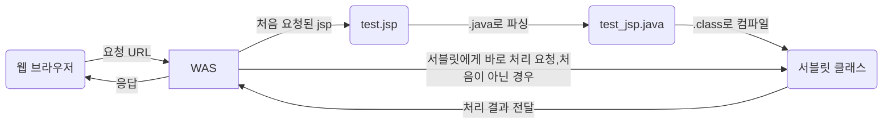
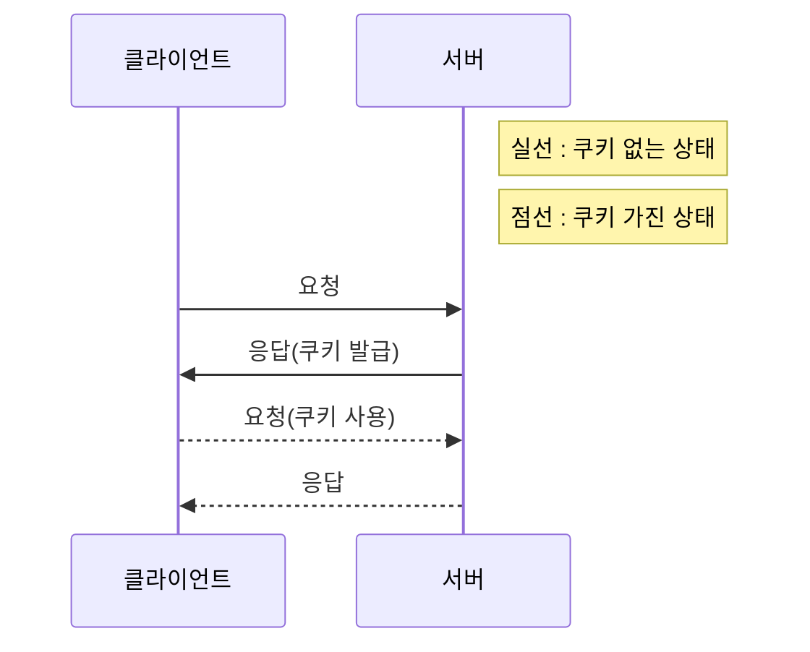

# JSP (Java Server Pages)
* `동적 웹 페이지`[(링크)](./WEB.md)의 사용되는 자바의 표준 기술
* 서버단에서 로직 등을 통하여 웹 페이지를 동적으로 조작
* HTML 응답을 생성하는 기능 제공
### WAS
* Web Application Server
  * 톰캣, 제티, ...
* `동적인 컨텐츠`의 로직 처리를 하기 위함


1. HTTP 요청 : http://localhost:8080/test.jsp
2. 실행 : jsp의 java 코드 등을 컴파일 후 실행
3. HTTP 응답


# JSP 구성 요소
> ## Directive(디렉티브)
* 지시자
* JSP 페이지에 대한 설정 정보를 지정할 떄 사용
1. <%@ page %> : page 지시자
<table>
    <thead>page 지시자의 속성</thead>
    <tr>
        <th>속성</td>
        <th>내용</td>
    </tr>
    <tr>
        <td>contentType</td>
        <td>
            JSP가 생성하는 문서의 콘텐츠 타입을 설정하는 속성
            <br>text/html; : 기본값
            <br>charset=UTF-8 : html의 인코딩 방식을 utf-8로 설정
        </td>
    </tr>
    <tr>
        <td>
            pageEncoding
        </td>
        <td>
            JSP의 문자 인코딩을 설정하는 속성
            <br>ISO-8859-1 : 기본값
        </td>
    </tr>
    <tr>
        <td>
            language
        </td>
        <td>
            JSP의 프로그래밍 언어를 설정
            기본값 : java
        </td>
    </tr>
    <tr>
        <td>import</td>
        <td>사용해야되는 패키지.클래스를 임포트하는 속성</td>
    </tr>
    <tr>
        <td>info</td>
        <td>JSP에 대한 설명을 담는 속성</td>
    </tr>
</table>

2. <%@ taglib %> : taglib 지시자
3. <%@ include %> : include 지시자

> ## Script(스크립트)
* 문서의 내용을 동적으로 생성하기 위해 사용
  * 폼에 입력한 정보를 서브밋 하여 데이터베이스에 저장
  * 데이터베이스의 데이터를 읽어오기
### Scriptlet(스크립트릿)
* <% %>
* JAVA 코드를 실행하는 요소
* 여기서 선언되는 변수들은 지역 변수

### Expression(표현식)
* <%= %>
* 변수에 입력된 값 등을 출력하는 요소

### Declaration(선언부)
* <%! %>
* 변수, 메소드 선언하는 요소
* 해당 영역에서 선언하는 것은 클래스의 멤버(변수, 메소드)가 됨


> ## JSP 동작 과정
1. 브라우저에서 해당 test.jsp 을 요청
2. 톰캣(웹서버 + WAS)가 서블릿 컨테이너에게 요청을 전달
3. java 코딩이 되어있는 .jsp파일을 servlet(.java) 파일로 파싱
4. .class 파일로 컴파일되고 실행
5. 웹 브라우저가 인식하는 HTML로 실행


1. 작성된 test.jsp 파일
```html
<%@ page contentType="text/html;charset=UTF-8" pageEncoding="UTF-8" %>
<%--페이지가 자바(기본값) 문법을 통해서 html으로 작성될 문서이고, 인코딩은 UTF-8로 하겠다는 지시자--%>

<%! 
    String name = "두부쿠키";
    int age = 29;
%>

<%
    // 스크립트릿
    for (int i = 1; i <= 10; i++) {
    // 스크립트릿을 중간에 끊어서 다른 html 태그를 중간에 두고 이어서 코딩할 수 있음
%>
<li>이름 : <%=name%> / 나이 = <%=age%> / <%=i%>번 실행</li>
<%
    } // i for 문
%>
```
2. 파싱된 서블릿(.java) 클래스
```java
// 자바 코딩 적기
```

3. 출력된 html
```html
<li>이름 : 두부쿠키 / 나이 = 29 / 1번 실행</li>

<li>이름 : 두부쿠키 / 나이 = 29 / 2번 실행</li>

<li>이름 : 두부쿠키 / 나이 = 29 / 3번 실행</li>

<li>이름 : 두부쿠키 / 나이 = 29 / 4번 실행</li>

<li>이름 : 두부쿠키 / 나이 = 29 / 5번 실행</li>

<li>이름 : 두부쿠키 / 나이 = 29 / 6번 실행</li>

<li>이름 : 두부쿠키 / 나이 = 29 / 7번 실행</li>

<li>이름 : 두부쿠키 / 나이 = 29 / 8번 실행</li>

<li>이름 : 두부쿠키 / 나이 = 29 / 9번 실행</li>

<li>이름 : 두부쿠키 / 나이 = 29 / 10번 실행</li>

```


> ## Expression Languge(표현 언어)
### 형식
* `${표현식}`의 형태
  * 정해진 문법을 따르는 표현식을 입력하여 기능 실행
* 코드를 간결하게하여 이해하기 좋게 만듦

> ## 기본 객체
* JSP가 어플리케이션 기능 구현에 필요한 기능을 제공하는 기본 객체
## request
* 클라이언트의 `요청`한 서버와 관련된 정보를 저장하는 객체
  * 파라미터
  * 헤더
  * 쿠키 정보
  * ...
* 메소드
<table>
    <thead>
        request객체의 메소드
    </thead>
    <tr>
        <td>.getContextPath()</td>
        <td>어플리캐이션의 컨텍스트 경로를 가져와서 반환</td>
    </tr>
    <tr>
        <td>.getRemoteAddr()</td>
        <td>클라이언트의 IP주소를 가져와서 반환</td>
    </tr>
    <tr>
        <td>.getMethod()</td>
        <td>클라이언트가 전송 요청할 떄, 전송 방식(get,post)을 가져와 반환</td>
    </tr>
    <tr>
        <td>.getRequestURL()</td>
        <td>클라이언트가 전송 요청한 URL을 가져와 반환</td>
    </tr>
    <tr>
        <td>.getRequestURI()</td>
        <td>클라이언트가 전송 요청한 URI을 가져와 반환</td>
    </tr>
</table>

* 웹 브라우저가 전송한 파라미터를 읽어올 수 있는 메서드
<table>
<tr>
    <td>메소드</td>
    <td>내용</td>
</tr>
<tr>
    <td>.getParameter()</td>
    <td>
        기능 : 매개변수로 받은 파라미터의 값을 반환
        <br>매개변수 : String 파라미터의 이름
        <br>리턴 : String 파라미터의 값
    </td>
</tr>
<tr>
    <td>.getParameterValues()</td>
    <td>
        기능 : 매개변수로 받은 파라미터의 값들을 모두 반환
        <br>매개변수 : String 파라미터의 이름
        <br>리턴 : String[] 파라미터의 값을 담은 배열
    </td>
</tr>
<tr>
    <td>.getParameterNames()</td>
    <td>
        기능 : 웹 브라우저가 요청한 파라미터의 이름을 반환
        <br>매개변수 : -
        <br>리턴 : Enumeration<E> 파라미터의 이름을 담은 열거자
    </td>
</tr>
<tr>
    <td>.getParameterMap()</td>
    <td>
        기능 : 웹 브라우저가 요청한 파라미터의 이름과 그 값을 반환
        <br>매개변수 : -
        <br>리턴 : Map<E> 파라미터의 이름을 키 값, 값을 밸류로하는 맵을 반환
    </td>
</tr>
</table>


## response
* 웹 브라우저로 응답하는 정보를 담는 객체
* 주요 기능
  * `응답` `헤더` 정보 입력
  * `리다이렉트` 기능 

### 리다이렉트
1. URL을 통하여 서버에 요청
2. 해당 서버에서 다른 URL을 포함한 응답
3. 응답을 받은 브라우저가 `다른 웹 컨테이너`에서  응답 받은 새로운 URL로 요청 
4. 새로운 URL에서 응답 받음


*  리다이렉트될 떄는 `웹 컨테이너가 바뀌기 떄문에` 새로운 request, response 객체를 생성

### 포워딩
1. URL을 통하여 서버에 요청
2. `동일한 웹 컨테이너`에서 해당 요청을 서버의 다른 자원으로 전달
3. 클라이언트는 그 자원이 주는 응답을 받음


* 요청한 URL 경로는 바뀌지 않기 때문에 웹 브라우저에서 확인 불가
* `같은 웹 컨텡이너`에서 일어나기 때문에 request, response를 공유


### 인코딩 디코딩


* UTF-8 : 한글 지원(3바이트)

> ## out
* jsp 페이지의 변수와 같은 값들을 출력하는데 사용하는 객체
* 출력 스트림
### 메소드
* .append()
* .print() / println()
  * 내용을 출력하는 메소드
  * ln은 "\r\n"이므로 html에서는 개행이 안됨
### 버퍼 관련 메소드
* .getBufferSize()
  * 출력 버퍼의 크기를 반환하는 메소드
    * 지시자에서 buffer="8kb"로 주면 8kb로 설정
  * 매개변수 : -
  * 리턴 : int (출력 버퍼, 바이트 단위)
* .clearBuffer()
  * 출력 버퍼의 저장된 내용을 클리어 시키는 메소드
  * 매개변수 : -
  * 리턴 : void
* .getRemaining()
  * 출력 버퍼의 남은 내용을 바이트 단위로 반환하는 메소드
  * 매개변수 : -
  * 리턴 : int 
* .flush()
  * 현재 버퍼의 내용을 flush(출력)하는 메소드
  * 매개변수 : -
  * 리턴 : void
* .isAutoFlush()
  * 출력 버퍼의 용량이 다 차서 자동으로 flush되었는지를 확인하는 메소드
  * 매개변수 : -
  * 리턴 : boolean

> ## pageContext
* pageContext객체는 jsp 페이지의 정보를 나타내는 객체
  * 이 객체를 통하여 다른 기본 객체에 접근할 수 있음
* 속성 처리 가능
* 페이지 흐름 제어
* 에러 데이터
### 다른 기본 객체로 접근
* pageContext.getRequest().getParameter("name");
* pageContext.getResponse();
* pageContext.getOut();
* pageContext.getSession();

> ## application
* 웹 애플리케이션과 관련된 정보를 나타내는 객체
  * 한 어플리케이션 안의 모든 jsp 페이지에서 공유하는 1개의 객체
  * 모든 jsp 페이지에서 공유하는 정보를 저장/읽기

### \<context-params>
* web.xml에 해당 태그를 추가하여 웹 어플리케이션의 전반적인 환경설정 정보를 저장
* .getInitParameter(String pname)
  * web.xml에 설정된 파라미터 pname의 값을 반환
  * 매개변수 : String
  * 리턴 : String, 파라미터 밸류
* .getRealPath(String url)
  * url을 실제 배포 경로로 반환
  * 매개변수 : String
  * 리턴 : String, 배포 경로

```xml
<!--web.xml-->
    <context-param>
        <description>파일 경로</description>
        <param-name>filePath</param-name>
        <param-value>/test</param-value>
    </context-param>
```

```java
<%
    // .jsp 파일
    String filePath = application.getInitParameter("filePath");
    String realPath = application.getRealPath(filePath);
    // /Users/hwan/Class/JSPClass/jspPro/target/jspPro-1.0-SNAPSHOT/test
%>
```

> ## 기본 객체의 영역

<table>
    <tr>
        <td>영역</td>
        <td> 내용</td>
    </tr>
    <tr>
        <td>application</td>
        <td>웹 어플리케이션 전체에서 사용되는 영역</td>
    </tr>
    <tr>
        <td>session</td>
        <td>하나의 브라우저에서 사용되는 영역</td>
    </tr>
    <tr>
        <td>request</td>
        <td>하나의 요청 처리할 때 사용되는 영역<br>포워딩 시, 요청이 하나이므로 영역에 속하게 됨</td>
    </tr>
    <tr>
        <td>page</td>
        <td>하나의 jsp 페이지를 처리할 때 사용되는 영역</td>
    </tr>
</table>

# 쿠키, 세션

>## 쿠키
* 사용자가 웹 사이트 방문할 경우
  * 사용자의 컴퓨터나기기에 `작은 텍스트 파일`로 저장되는 데이터
* HTTP는 기본적으로 `connectionless`(응답 후 연결 끊는 특징)과 `stateless`(통신 끝나면 상태 유지하지 않는 특징)특성을 갖기 때문에 `쿠키(와 세션)`을 사용
  * 장바구니
  * 최근 방문 정보
  * 로그인 정보 
  * ...



### 쿠키 이름
* 쿠키의 이름을 나타내는 구성 요소
* 필수

### 쿠키 값
* 쿠키의 값을 나타내는 텍스트 구성 요소
* 필수

### 만료시점
* 쿠키의 만료시점을 설정하는 구성 요소
* 별도의 만료 시점을 안주면 웹 브라우저 종료 시 제거
  * -1 : 브라우저 닫을 때 쿠키 제거
  * 0 : 응답 받는 즉시 쿠키 제거 (쿠키 삭제 원할 때 사용)


### 쿠키생성

```java
Cookie cookie = new Cookie(String쿠키명, String쿠키값);
cookie.setMaxAge(-1); //브라우저 닫을 떄 까지 쿠키 유지
```
* c.setXXX();
  *  만료시점, 도메인, 경로, ... 설정

### 쿠키응답
```java
respnse.addCookie(cookie);
```
> ## 세션
* 쿠키와는 다르게 서버에 저장하는 방식
* 상태 관리 등을 위해 사용


# 커넥션풀(DBCP)
* JDBC 연동을 할떄, Connection를 매번 생성, 닫기 작업 필요
* 동시 접속자가 많아지면 성능이 떨어짐
>## 사용방법

1. 커넥션 풀 등록
```html
<!--프로젝트 폴더 안, META-INF 폴더 안, content.xml-->
<Context>
  <Resource
    name="jdbc/myoracle"
    auth="Container"
    type="javax.sql.DataSource"

    driverClassName="oracle.jdbc.OracleDriver"
    url="jdbc:oracle:thin:@127.0.0.1:1521:mysid"
    username="scott"
    password="tiger"2
    p423
    maxTotal="20" <!--커넥션 풀 안에 최대 생성할 커넥션 객체의 수-->
    maxIdle="10" <!--커넥션 풀이 보관할 수 잇는 최대 유효 객체 수()대기-->
    maxWaitMillis="-1"
  />
</Context>
```

```html
<!--프로젝트 폴더 안, META-INF 폴더 안, content.xml-->
<resource-ref>
  <description>Oracle Datasource example</description>
  <res-ref-name>jdbc/myoracle</res-ref-name>
  <res-type>javax.sql.DataSource</res-type>
  <res-auth>Container</res-auth>
</resource-ref>
```

2. 등록한 커넥션풀을 통해 Connection 객체 생성

```java
Context initContext = new InitialContext();
Context envContext  = (Context)initContext.lookup("java:/comp/env");
DataSource ds = (DataSource)envContext.lookup("jdbc/myoracle");
Connection conn = ds.getConnection(); //커넥션풀에서 Connection객체생성
conn.close();//커넥션풀으로 생성한 Connection객체 반환
```

# Form
> ## \<form>\</form>

* html 태그
* 웹 페이지의 입력 양식을 의미
* 요소
  * name 
    * 폼의 이름
    * 데이터의 이름으로 지정
  * action
    * 데이터가 전송되는 백엔드 URL 
  * method
    * GET : 쿼리스트링 &rarr; ?name속성값=입력값&...
      * 캐쉬되어 저장
      * 보안 취약
      * 기본 값
    * POST : http 내부 저장 전송
      * 브라우저에 의해 캐시되지 않음 &rarr; 히스토리에 남지 않음
      * 보안 안정적

> ## \<input>\<input>
* 입력하기 위한 태그
* 요소
  * type
    * 입력 종류 
    * 텍스트, 버튼, ...
  * name
    * 데이터 이름
  * value
    * 기본 값
<table>
    <caption>input type 종류</caption>
    <tr>
        <td>submit</td>
        <td>< form > 요소의 데이터를 서버로 전송</td>
    </tr>
    <tr>
        <td>reset</td>
        <td>< form > 의 데이터 초기화</td>
    </tr>
    <tr>
        <td>text</td>
        <td>문자 입력</td>
    </tr>
    <tr>
        <td>button</td>
        <td>버튼 형식</td>
    </tr>
    <tr>
        <td>radio</td>
        <td>라디오버튼<br>name속성이 같은 버튼끼리 그룹</td>
    </tr>
    <tr>
        <td>checkbox</td>
        <td>체크박스<br>name속성이 같은 체크박스끼리 그룹, 중복 가능</td>
    </tr>
    <tr>
        <td>file</td>
        <td>파일 첨부<br>multiple속성으로 여러 파일 선택 가능</td>
    </tr>
    <tr>
        <td>password</td>
        <td>비밀번호<br>*표로 표시</td>
    </tr>
    <tr>
        <td>date</td>
        <td>날짜 형식</td>
    </tr>

</table>

# Servlet
* JAVA 클래스를 이용하여 웹 어플레이션을 만드는 기술
>## 구현 과정
1. `Servlet 규약`에 따른 자바 클래스를 선언
   * 자바 클래스의 접근지정자 : public
   * `javax.servlet.http.HttpServlet` 클래스를 상속
   * service(), get(), post() 오버라이딩

2. .java 파일에 자바 코딩 &rarr; 컴파일 &rarr; .class 파일 생성
3. .class 파일 웹 프로젝트에 /WEB-INF/classes 패키지에 위치
   * (이클립스와 같은 IDE를 사용하면 2~3의 과정은 자동으로 이루어짐)
4. web.xml에 서블릿 클래스 설정 & @WebServlet 어노테이션 사용
5. 웹 컨테이너인 WAS(톰캣)을 실행
6. URL로 요청 &rarr; URL패턴에 해당되면 응답


### web.xml 서블릿 설정
```xml
<!--서블릿 클래스를 등록하는 부분-->
<servlet>
  <!--설명-->
  <description>현재 날짜 시간을 나타내는 서블릿</description>
  <!--서블릿 클래스의 이름을 설정(매핑 시 사용)-->
  <servlet-name>now</servlet-name>
  <!--사용할 클래스를 설정-->
  <servlet-class>test.Now</servlet-class>
</servlet>

<!--서블릿 클래스를 매핑하는 부분-->
<servlet-mapping>
  <!--매핑할 서블릿의 이름(위에서 등록한 이름)-->
  <servlet-name>now</servlet-name>
  <!--서블릿 클래스가 매핑될 url 패턴들-->
  <url-pattern>/test/*</url-pattern>
</servlet-mapping>
```

### @WebServlet으로 매핑

```java
package test;

import javax.servlet.*;
import javax.servlet.http.*;
import javax.servlet.annotation.*;

@WebServlet(
  /*서블릿에 대한 설명*/
  description = "@WebServlet 어노테이션 사용 자동 서블릿 등록",
  /*서블릿 클래스가 매핑될 url 패턴들*/
  urlPatterns = {
    "/now",
    "/test/*"
  })

/*HttpServlet 상속 필수*/
public class Now extends HttpServlet {

    public Info() {
        super();
    }

    @Override
    public void service(ServletRequest req, ServletResponse res) throws ServletException, IOException {}

    @Override
    protected void doGet(HttpServletRequest request, HttpServletResponse response) throws ServletException, IOException {}

    @Override
    protected void doPost(HttpServletRequest request, HttpServletResponse response) throws ServletException, IOException {}
```


