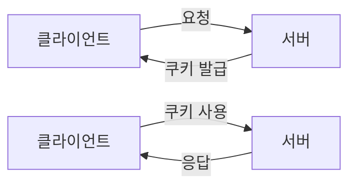

# JavaScript
* 객체 기반의 스크립트 프로그래밍 언어
* 목적
  * `웹페이지` 사용자의 반응 처리
  * 사용자의 특정 `이벤트`나 `입력 값`을 받아서 동적으로 처리
* 용도
  * html 내용 변경
  * html 속성 변경
  * html 스타일 변경
  * html 요소 보이기 / 숨기기
  * ...
* 주로 프론트엔트 개발에서 UI / UX를 향상시키기는 목적으로 사용
  * 현재는 서버측 프로그램 개발에도 많이 사용(Node.js, ...)
* 설치 X
  * 클라이언트 브라우저에 내장되어있는 js 엔진 사용
* 자바 스크립트 표준
  * ECMAScript (에크마 스크립트) : ECMA-262
* 형식
```html
<script>
    //js 코딩 ...
</script>

<!-- 외부 .js 파일 연결 -->
<script src="test.js"></script>
```
* 외부 자바스크립트 파일 사용 시
  * html 코딩과 분리 - 유지, 보수 / 확장 용이
  * 캐싱된 js파일 - 페이지 로드 속도 향상 

> ## DOM
* Document Object Model
* HTML문서 객체 기반 표현 방식
  * \<body> \<html>태그를 JavaScript가 객체로서 접근하여 사용하는 방식


### 노드 트리 표현
* 트리 구조
* root node : \<html>

```bash
html
├── head
│   └── title
│       └── 페이지 제목 
└── body
    ├── h3
    │   └── 헤드라인 
    ├── p
    │   └── 내용..abcd... 
    └── img
```

## 데이터 타입
### document
* 브라우저가 불러낸 웹페이지를 나타냄
* 요소를 생성하거나, 가져오고, URL을 얻어오는 데, ... 사용
1. 속성
  * document.body
    * 현재 문서의 \<body> 태그를 리턴
  * document.documnetURI
    * 현재 문서의 위치를 반환
  * ...
2. 메소드
  * document.createElement()
    * 태그명을 매개변수로 받아, 요소를 만드는 메소드
  * document.getElementById()
    * 아이디명에 해당되는 element를 반환
  * document.querySelector()
    * 선택자에 해당되는 첫 element를 반환
  * document.querySelectorAll()
    * 선택자에 해당되는 element NodeList를 반환
  * document.write()
    * 문서에 작성하는 메소드
  * ...
### element
* 요소 또는 요소에 대한 node를 의미
1. 속성
  * element.innerHTML
    * 해당 요소의 내용을 HTML로 반환
  * element.innerText
    * 해당 요소의 내용을 text로 반환
  * element.nextElementSibling
    * 해당 요소의 다음 형제 요소를 반환
2. 메소드
  * element.append()
    * 해당 요소의 자식으로 노드 객체나 문자열을 삽입하는 메소드

### node
* 노드를 나타내는 객체
1. 속성
  * node.nextSibling
    * 다음으로 오는 형제 node를 반환
  * node.parentElement
    * 부모 노드에 오는 element를 반환
2. 메소드
  * node.appendChild()
    * 해당 노드에 자식으로 노드나 요소를 삽입하는 메소드
  * node.cloneNode()
    * 해당 노드를 복제한 노드를 반ㄴ환하는 메소드

### nodeList
* element의 배열(집합)
* item은 index를 통해서 접근
  * list.item(1)
  * list[i]


> ## 연산자
<table>
    <tr>
        <td colspan="2">산술연산자</td>
    </tr>
    <tr>
        <td>+</td>
        <td>덧셈 연산자</td>
    </tr>
    <tr>
        <td>-</td>
        <td>뺄셈 연산자</td>
    </tr>
    <tr>
        <td>*</td>
        <td>곱셈 연산자</td>
    </tr>
    <tr>
        <td>/</td>
        <td>나눗셈 연산자</td>
    </tr>
    <tr>
        <td>%</td>
        <td>나머지 연산자</td>
    </tr>
    <tr>
        <td>**</td>
        <td>제곱 연산자</td>
    </tr>
    <tr>
        <td colspan="2">증감 연산자</td>
    </tr>
    <tr>
        <td>++</td>
        <td>1 증가</td>
    </tr>
    <tr>
        <td>--</td>
        <td>1 감소</td>
    </tr>
    <tr>
        <td colspan="2">대입(할당) 연산자</td>
    </tr>
    <tr>
        <td>=</td>
        <td>대입 연산자 / 우항의 값을 좌항에 대입</td>
    </tr>
    <tr>
        <td>+=</td>
        <td>좌항에 값에 우항을 더한 값을 좌항에 대입</td>
    </tr>
    <tr>
        <td>-=</td>
        <td>좌항에 값에 우항을 더한 값을 좌항에 대입</td>
    </tr>
    <tr>
        <td>...</td>
        <td>*=, /=, %=, **=</td>
    </tr>
    <tr>
        <td colspan="2">비교 연산자</td>
    </tr>
    <tr>
        <td>==</td>
        <td>같은지 비교 / 타입은 비교하지 않음</td>
    </tr>
    <tr>
        <td>===</td>
        <td>같읁비 비교 / 타입도 비교</td>
    </tr>
    <tr>
        <td>>, < <br>>=, <=</td>
        <td>좌항 우항의 값 크기를 비교</td>
    </tr>
    <tr>
        <td>!=</td>
        <td>같지 않으면 true 반환</td>
    </tr>
    <tr>
        <td colspan="2">논리 연산자</td>
    </tr>
    <tr>
        <td>&&</td>
        <td>and</td>
    </tr>
    <tr>
        <td>||</td>
        <td>or</td>
    </tr>
    <tr>
        <td>!</td>
        <td>not</td>
    </tr>
    <tr>
    <tr>
        <td colspan="2">타입 연산자</td>
    </tr>
    <tr>
        <td>typeof</td>
        <td>대상의 타입을 나타내는 연산자</td>
    </tr>
    <tr>
        <td>a instanceof b</td>
        <td>b의 프로토타입이 a객체의 프로토타입 체인에 있는지</td>
    </tr>
    <tr>
        <td colspan="2">비트 연산자</td>
    </tr>
    <tr>
        <td>...</td>
        <td>& | ~  ^ << >> >>></td>
    </tr>
</table>

---

> # 자료형
<table>
<tr>
  <td>String</td>
  <td>
    문자열 데이터
    <br>요소(16비트,부호없는정수)의 집합
    <br>요소 하나당 string 한 자리, 인덱스(0 ~)
  </td>
</tr>
<tr>
  <td>Number</td>
  <td>
    숫자 데이터  
    <br>&pm;(2^53-1)까지의 수
    <br>정수, 실수 모두
    <br>&pm;Infinity, NaN 값 포함
  </td>
</tr>
<tr>
  <td>Boolean</td>
  <td>
    true / false 값을 가지는 자료형
    <br>의미 없는 값 : false(0, NaN, null, "", undefined)
    <br>의미 있는 값 ; true(1, "글자", ...)
  </td>
</tr>
<tr>
  <td>BigInt</td>
  <td>
    큰 정수를 임의의 정밀도로 갖는 자료형
  </td>
</tr>
<tr>
  <td>undefined</td>
  <td>
    선언된 변수에 할당하지 않은 변수에 자동으로 할당되는 값
  </td>
</tr>
<tr>
  <td>null</td>
  <td>
    의도적으로 비어있는 값을 나타냄
  </td>
</tr>
<tr>
  <td>Object</td>
  <td>
    관련된 데이터(속성)과 함수(메소드)의 집합
    <br>객체
  </td>
</tr>
</table>

### typeof 연산자
* 대상의 타입을 반환하는 연산자
  * typeof()함수도 가능
```javascript
console.log(typeof 100); //umber
console.log(typeof 3.14); //number
console.log(typeof "abc"); //string
console.log(typeof undefinded); //undefined
console.log(typeof null); //object
```

> ## String
* 문자열 자료형
* ""(큰따옴표), ''(작은 따옴표) 사이에 내용
  * var text = "abcd";
* 0개 이상의 문자 집합
* 연결
  * \+
  * concat()
### String관련된 유용한 함수
* String.trim()
  * 문자열 좌, 우 끝에 공백을 지움
* String.replace(searchString, replacement)
  * 문자열에서 일치하는 문자열을 찾아 대체
  * 매개변수
    * searchString : 찾는 문자열이나 정규표현식
    * replacement : 대체할 문자열
  * 리턴
    * String
    * 변경된 문자열
* String.substring(from, to) / String.slice(from, to)
  * 문자열의 원하는 위치 값에 문자(열)을 반환하는 함수
  * 매개변수
    * from : 시작 인덱스 (0부터 시작)
    * to : 끝 인덱스, 이 인덱스 이전까지 리턴
  * 리턴
    * String
    * 해당 인덱스의 문자열
* String.split(pattern)
  * 매개변수를 구분자로 문자열을 나누는 함수
  * 매개변수
    * 구분자로 사용할 문자열이나, 정규표현식
  * 리턴
    * Array(object)
    * 구분자로 나누어진 문자열의 배열을 반환
* padStart() / padEnd()
  * 정해진 자리만큼 채우고 문자열로 반환하는 함수
* startWith() / endWith()
  * 대상 문자열에 인자값이 시작하는지/끝나는지 판별하여 boolean값 반환하는 함수
* includes()
  * 대상 문자열에 인자값이 있는지 판별하여 boolean 값을 반환하는 함수

### 정규표현식
* string에서 특정 규칙으로 된 문자 조합을 찾기 위한 패턴
* //사이에 정규표현식 패턴 표시
* 변경자(modifier)
  * i : 대소문자 구분 X
  * g : 전체 문자열에서 모두 검색
  * m : 여러 줄 검색
* 선언 및 할당
  * /pattern/modifier
```javascript
const pattern  = /hong/ig 
//대소문자 구분 없이 hong 모두 검색하기 위한 정규표현식 
```

> ## 변수 선언
### 변수 선언 방법
1. var
* function-scoped
  * 블럭 안팍에서 같은 기억공간
* `hoisiting`시 자동으로 undefined로 초기화
  * 인터프리터가 변수의 메모리를 선언 전에 미리 할당함
* 변수 중복 선언 가능
```javascript
var test1 = 1;
var test1 = 10; //에러 없음

test2 = 100;
console.log('test2 = '+test2);
var test2; // 에러 없음(hoisting)
```

2. let
* block-scoped
  * 블럭안에서 할당한 값은 블럭 안에서만 유효
* `hoisting`시 변수를 자동으로 초기화하지 않음
  * block-scoped 단위로 호이스팅이 일어남
  * 변수 선언 전 변수에 할당 시 > [`tdz`](https://ui.toast.com/weekly-pick/ko_20191014)
* 변수를 중복으로 선언 불가 

```javascript
let test1 = 1;
let test1 = 100; // SyntaxError

test2 = 100;
let test2; // ReferenceError
```


3. const
* block-scooped
* let과 대부분 비슷한 규칙을 가짐
* 상수
  * 선언과 동시에 할당
  * 재할당 불가

```javascript
const test1; // Missing initializer in const declaration

const test2 = 3.14;
test2 = 3.141592 // SyntaxError
```

---

> ## 배열(Array)
* 인덱스에 대한 요소들을 갖고 있는 여러 데이터의 집합
  * typeof 배열 : object
    * 배열은 객체에 속하지만 순서와 길이가 있다는 차이가 있음
* 배열 선언
  * const 배열명 = [];
```javascript
const family1 = []; 
// let, var로도 선언 가능하지만 주로 const로 선언
family1[0] = '두부';
family1[1] = '쿠키';
family1[2] = '경환';
// 선언 시, 크기를 지정하지 않고 요소를 추가할 수 있음
//인덱스는 0부터 시작


const family2 = ['두부', '쿠키', '경환']
// 선언 시, 요소를 같이 선언할 수 있음
```

### 배열 정렬
* 기본적으로 sort()라는 함수를 사용해서 정렬
  * default는 오름차순
* 내림차순 정렬
  * `compare 함수`
  * localeCompare() 함수 - 문자열 비교
```javascript
const test = ['a','c','e','b','d'];

// 1. compare 함수
// 오름차순
test.sort(function compare(a, b) {
  if (a > b){
    return 1;
  }
  if (a < b){
    return -1;
  }
  //a must be equal to b
  return 0;
});
// 내림차순
test.sort(function compare(a, b) {
  if (a < b){
    return 1;
  }
  if (a > b){
    return -1;
  }
  //a must be equal to b
  return 0;
});

//2. localeCompare() 이용
// 오름차순
test.sort(function compare(a, b) {
  return a.localeCompare(b);
});
// 내림차순
test.sort(function compare(a, b) {
  return b.localeCompare(a);
});

//2-2. 람다식 표현
// 오름차순
test.sort((a,b)=>a.localeCompare(b));
// 내림차순
test.sort((a,b)=>b.localeCompare(a));
```

* number 정렬
  * 각각 비교 요소의 가장 첫자리씩 비교
  * 1, 2, 5, 30, 100 을 정렬 시
    * 1, 100, 2, 30, 5로 오름차순 정렬됨
  * `compare 함수` 필요

```javascript
const test = [1, 5, 2, 100, 30];
// 오름차순
test.sort(function compare(a, b) {
    return a - b;
});
//내림차순
test.sort(function compare(a, b) {
    return b - a ;
});
```

### 속성 및 함수
* Array.length
  * 배열의 길이(== 요소의 개수)를 반환
* Array.isArray()
  * 대상이 배열인지 판별하여 반환
    * typeof연산자로는 배열은 object로 반환
* 요소 추가 및 삽입

<table>
    <tr>
        <td colspan="2" align="center">요소 추가</td>
    </tr>
    <tr>
        <td>push()</td>
        <td>배열의 맨 뒤 새 요소 추가</td>
    </tr>
    <tr>
        <td>unshift()</td>
        <td>배열의 0번째 요소로 추가 <br>원래 요소들을 한 인덱스씩 뒤로 미룸</td>
    </tr>
    <tr>
        <td colspan="2" align="center">요소 제거</td>
    </tr>
    <tr>
        <td>pop()</td>
        <td>배열의 마지막 인덱스 요소를 제거하고 그 값을 반환</td>
    </tr>
    <tr>
        <td>shift()</td>
        <td>배열의 0번쨰 요소를 제거하고 그 값을 반환<br>나머지 요소들을 한 인덱스씩 앞으로 당김</td>
    </tr>
    <tr>
        <td>splice(idx,n,e1,e2,...)</td>
        <td>idx번째 인덱스 부터 n개의 요소를 제거 후<br>e1, e2, ... 의 값을 요소로 추가<br>n을 0 주면 삽입만 / e1, e2,... 생략 시 삭제만</td>
    </tr>
    <tr>
        <td colspan="2" align="center">배열 반환</td>
    </tr>
    <tr>
        <td>slice(from,to)</td>
        <td>from번째 인덱스 부터 to번쨰 인덱스 전까지 요소들을 잘라 배열로 반환<br>원래 배열 유지</td>
    </tr>
    <tr>
        <td>concat(a,b)</td>
        <td>a배열과 b배열을 이어서 새로운 배열을 반환</td>
    </tr>
    <tr>
        <td colspan="2" align="center">요소 검색</td>
    </tr>
    <tr>
        <td>includes(val)</td>
        <td>val값이 배열에 있는지 판별하여 true,false값을 반환</td>
    </tr>
    <tr>
        <td>indexOf(val)</td>
        <td>val값을 배열에서 검색하여 그 인덱스 값을 반환<br>없으면 -1</td>
    </tr>
</table>

---
> ## 객체(Object)
* 관련된 속성(엔티티, 함수, ...)을 담고있는 집합
* 선언
```javascript
const TestObj = {
  name : '경환',
  age : 29,
  gender : false
};
```
* 생성
  * 생성자를 통해서 새 객체 생성
```javascript
let obj = new TestObj();
```
### prototypea
* Javascript에서는 객체를 상속하기 위하여 프로토타입이라는 방식을 사용

> ## 유용한 객체
### Date
  * 197년 1월 1일 00:00:00:000~ 부터의 시간을 담는 객체
### Math
  * 연산 같은 수학적인 작업에 필요한 메소드와 속성을 갖는 객체
### Set
* 연관된 데이터들의 집합
  * 중복 허용 X
  * 순서 없음
* 생성
```javascript
const setTest = new Set();
```
* 속성 및 함수
### Map
* 한 쌍의 엔트리(키 + 밸류)들의 집합
* 생성
```javascript
const mapTest = new Map();
```
* 속성 및 함수

---
> ## Class
* 연관된 필드와 기능들로 정의하여 객체를 만들기 위한 틀 (`특별한 함수`)
  * 필드는 생성자 안에서 정의됨
  * 메소드(생성자 포함)들의 집합
* 선언
  * 생성자(필드값 포함)들과 메소드들을 나열
```javascript
class Person() {
  // 생성자
  constructor(name, age){
    this.name = name;
    this.age = age;
  }
  print
}
```


> ## Event 
* 시스템에 일어나는 사건(action)
  * 마우스 클릭
  * 키 입력
  * 포커스
  * ...

### 이벤트 연결
1. 인라인 방식
* 속성 태그에 `on이벤트` 속성을 통하여 연결
```javascript
<button onclick="js code..."></button>
```
* 동일한 이벤트 여러 개 적용 불가

2. 프로퍼티 방식
* `이벤트 핸들러 프로퍼티`에 등록하여 사용
```javascript
//버튼 요소 중 가장 첫번쨰 요소 선택
document.querySelecotr('button').onclick =  function() {
  let text = this.value
  console.log(text);
}
```
* this
  * 이벤트가 일어나는 대상
* 동일한 이벤트 핸들러 여러 번 사용 불가

3. 이벤트 리스너 방식
* 이벤트 리스너 메소드를 이용한 연결
  * addEventListner('이벤트',function(){})를 통하여 이벤트 등록
  * removeEventListner('이벤트',function(){})를 통하여 이벤트 제거

```javascript
let btn = document.querySelector("button#test");
btn.addEventListener('click', function () {
    alert('이벤트 발생')
})
```

### 이벤트 종류
<table>
    <tr>
        <td colspan="2" align="center">마우스 이벤트</td>
    </tr>
    <tr>
        <td>click</td>
        <td>대상 요소를 마우스로 클릭을 했다 떼는 이벤트</td>
    </tr>
    <tr>
        <td>mouseover</td>
        <td>대상 요소에 마우스 커서를 올리는 이벤트</td>
    </tr>
    <tr>
        <td>mouseout</td>
        <td>대상 요소에서 마우스 커서를 빼는 이벤트</td>
    </tr>
    <tr>
        <td>mousemove</td>
        <td>마우스를 움직이는 이벤트</td>
    </tr>
    <tr>
        <td colspan="2" align="center">키보드 이벤트</td>
    </tr>
    <tr>
        <td>keypress</td>
        <td>
            키를 누를 때, 문자 입력 전
            <br>기능키 인식 X / 대소문자 구분 O
        </td>
    </tr>
    <tr>
        <td>keydown</td>
        <td>
            키를 누를 때, 문자 입력 전
            <br>기능키 인식 O / 대소문자 구분 X
        </td>
    </tr>
    <tr>
        <td>keydown</td>
        <td>
            키를 땔 때, 문자 입력 후
            <br>기능키 인식 O / 대소문자 구분 X
        </td>
    </tr>
    <tr>
        <td colspan="2" align="center">UI 이벤트</td>
    </tr>
    <tr>
        <td>load</td>
        <td>
            페이지가 로드되는 이벤트
            <br>모든 요소가 모두 로드 되었을 때
        </td>
    </tr>
    <tr>
        <td>unload</td>
        <td>
            페이지 언로드되는 이벤트
            <br>새로운 페이지를 요청하거나, 페이지를 끌 때
        </td>
    </tr>
    <tr>
        <td>scroll</td>
        <td>페이지나 요소에서 스크롤을 하는 이벤트</td>
    </tr>
    <tr>
        <td colspan="2" align="center">포커스 이벤트</td>
    </tr>
    <tr>
        <td>focus</td>
        <td>포커스 되는 이벤트</td>
    </tr>
    <tr>
        <td>blur</td>
        <td>포커스를 잃는 이벤트</td>
    </tr>
    <tr>
        <td colspan="2" align="center">폼 이벤트</td>
    </tr>
    <tr>
        <td>change</td>
        <td>선택된 버튼이나 옵션이 바뀌는 이벤트</td>
    </tr>
    <tr>
        <td>submit</td>
        <td>폼을 제출하는 이벤트</td>
    </tr>
</table>


### 이벤트 버블링, 이벤트 캡처링
* 이벤트 버블링
  * 자식요소에 이벤트가 발생하면 부모요소에도 그 이벤트가 전달
* 이벤트 캡처링
  * 부모요소에 이벤트가 발생하면 자식요소에도 그 이벤트가 전달

```html
<div id="out">
    <h2>이벤트 버블링 체크</h2>
    <p id="in" >자식 p태그 클릭!</p>
</div>
<!--해당 상황에서 p태그 클릭시 div도 클릭됨-->

<script>
document.getElementById("out").onclick = function () {
    alert("out div click");
}

document.getElementById("in").onclick = function () {
    alert("in p click");
    event.cancelBubble=true;
    //자식 태그를 클릭했을떄 부모한테도 뜨는 버블링을 취소하는 코딩
}
</script>
```
---

 # 제어문

> ## 조건문
### if문
  * else if로 여러 조건 나열
  * 가장 먼저 만족하는 조건 블럭 수행
  * else 블럭은 아무 조건 해당 안될 때 수행
```javascript
if (condition){
  //js code
} else if (condition){
  //js code
} else {
  //js code
}
```
### switch문
  * key가 해당되는 값을 갖는 case 실행
```javascript
switch (key){
  case value:
    //js code
    break;
  case value:
    //js code
    break;
  // :
  default
    //js code
    break;
}
```

> ## 반복문
### for문
```javascript
for (let i = 0; i < Array.length; i++) {
    //js code
    //i가 0부터 Array.length보다 작을 때까지 반복
}
```
* for ... in 문
  * 객체(배열)의 첫번째 키 값부터 마지막 키 값까지 반복
* for ... of 문
  * 객체(배열)의 첫번쨰 속성 값부터 마지막 속성 값까지 반복
* Array.forEach 함수
  * 배열 처음 인덱스부터 마지막 인덱스까지 반복하는 반복 함수

```javascript
const TestObj = {
  name : '경환',
  age : 29,
  gender : false
};

for (var key in obj) {
  console.log(key); // name / age / gender
}

for (var value of iterable) {
  console.log(value); // '경환' / 29 / false
}

const testArr = [11,12,13,14,15];
testArr.forEach(function(elt,idx,array){
    console.log(index+":"+elt);
}); 
// 1:11 / 2:12 / 3:13 / 4:14 / 5:15
// array는 배열 전체
```

### while문
* 조건이 만족할 떄까지 반복
* do ... while 문
  * 먼저 조건없이 do{} 을 실행하고, 조건이 만족할 때 까지 반복
```javascript
//1. while
while (condition){
  //codition 만족할 떄 까지 반복
}

//2. do while
do{
  //1번 실행 후
  //condition 만족할 떄 까지 반복
}while(condition)
```

### break, continue
* break;
  * 해당 코드를 만나면 바로 반복문 벗어남
* continue;
  * 해당 코드를 만나면 반복문에서 다음 루프로 넘어감


 # 함수(Function)
> ## 함수 선언
```javascript
function 함수명([매개변수...]){
  [return 리턴값]
} 
```
* 익명함수
  * 함수명 선언시 함수명을 명시하지 않은 함수 `다른 곳`에서 호출하지 않음
  * 이벤트 핸들러로 역할, ...
```javascript 
document.querySelector("button").onclcick = function() {
  alert("이벤트 발생");
}
```
> ## 함수호출
1. 일반적인 함수 호출
```javascript 
function sum(a,b=10){
  return a+b;
}

let x = sum(10, 11) // 21
let y = sum(10) // 1
```
* 이벤트 핸들러로 호출
```html
<button onclick="clickBtn()">test</button>
<script>
  function clickBtn() {
    alert('함수 호출됨');
  }
</script>
```
2. 자체 호출 함수
* 함수의 선언부와 호출부가 같이 있는 형태
  * 함수 선언 + 함수 호출
  * (함수선언부)() 로 호출
```javascript
(function () {
  return a+b;
})();
```


# 쿠키(HTTP cookie)
* `HTTP`의 일종
* 사용자가 웹 사이트 방문할 경우
  * 사용자의 컴퓨터나기기에 `작은 텍스트 파일`로 저장되는 데이터
* HTTP는 기본적으로 `connectionless`(응답 후 연결 끊는 특징)과 `stateless`(통신 끝나면 상태 유지 X)특성을 갖기 때문에 `쿠키(와 세션)`을 사용
  * 장바구니
  * 최근 방문 정보
  * 로그인 정보 
  * ...




