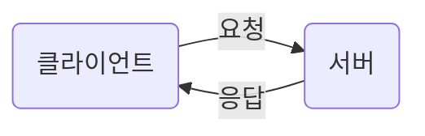

# WEB
> ## Internet
1. 전 세계를 연결하는 국제 정보 통신망
2. <abbr title="Advanced Research projects Agency">ARPA</abbr>가 1969년에 웹의 모태가 되는 ARPANET 개발
3. 군사용과 민간용으로 개발되다 민간용으로 사용되던 네트워크가 현재의 인터넷이 됨

> ## WEB
* 인터넷에 연결하여 여러 컴퓨터들 간 정보(텍스트, 파일, 영상, 이미지, ...)를 공유하는 공간
### W3C
  * World Wid Web Consortium
  * 국제 웹 표준 기구
  * 웹 제작에 대한 표준안을 제시

### 웹 브라우저
* 인터넷에서 정보를 검색하는 데 사용되는 프로그램

### WEB 2.0
* 서로 다른 사용자가 함께 새로운 컨텐츠를 창조할 수 있게 된 시대

### 웹의 3요소
<table>
<tr>
    <td>HTML</td>
    <td>웹의 내용을 담당 연결이 가능한 텍스트</td>
</tr>
<tr>
    <td>HTTP</td>
    <td>정보를 주고 받을 수 있는 통신규약</td>
</tr>
<tr>
    <td>URI</td>
    <td>통합 자원 식별자</td>
</tr>
</table>
> ## 웹 동작

* 기본적으로 정적 웹을 보면 간단하게, 클라이언트가 웹 서버에 파일을 요청하면 그 파일을 보내주는 응답을 함

### 동적 웹
